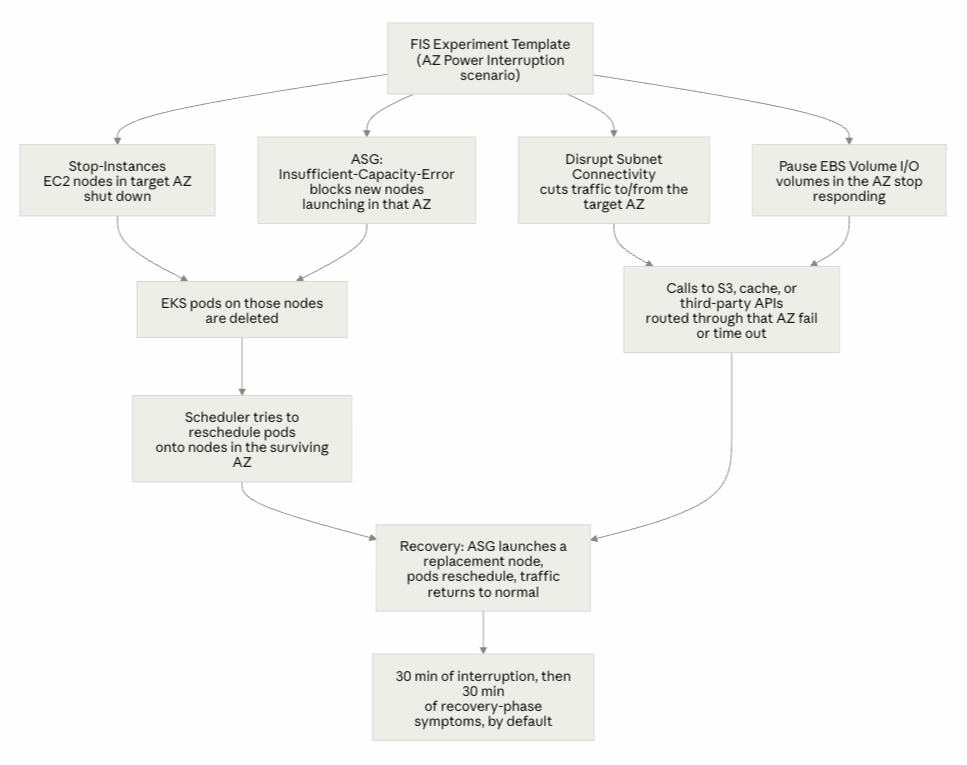

ช่วงที่ผ่านมาเราได้มีโอกาสได้จับงาน chaos engineering เพื่อให้ลูกค้าเห็นว่าระบบงานที่พัฒนาอยู่สามารถให้บริการต่อได้เมื่อเกิดเหตุไม่คาดคิดขึ้น (disaster) อาทิเช่น แผ่นดินไหว ไฟดับ data center ล่ม เป็นต้น ยิ่งเรามี requirement ให้สามารถ recover กับ disaster หลากหลายแบบได้เมื่อไร ก็ยิ่งมีค่าใช้จ่ายในการพัฒนาดูแลลระบบมากขึ้นเท่านั้น  

ประเด็นคือเรามีเวลาเพียงแค่ 3 วันในการเก็บหลักฐานเพื่อแสดงให้ลูกค้าเห็น บวกกับเราไม่เคยมีประสบการณ์ในการลงมือทำจริง ๆ แค่อ่านผ่าน ๆ เป็นทฤษฎี แน่นอนว่านี่มัน Mission Impossible ชัด ๆ แต่การมาของ GenAI มันทำให้เรื่องนี้ Possible ได้ ก็เลยอยากมาแบ่งปันประสบการณ์ และมุมมองของการใช้งาน GenAI ให้มันช่วยพัฒนาทักษะของเราเพื่อเพิ่มคุณค่าในตัวเรามากกว่ายกคุณค่าให้ GenAI ไปทั้งหมด  

## เข้าเรื่อง
พอเราไม่เคยมีประสบการณ์ในงานด้านนี้เท่าไร ทำให้ความต้องการของตนเองนั้นไม่ชัดเจน (ชัดเจนที่สุดคือต้องการพิสูจน์ disaster recovery ผ่านการทดสอบด้วยระบบใน AWS) ทำให้การใช้งาน GenAI ติดขัดตั้งแต่เริ่มต้น คือต่อให้ใช้งานแบบ naive เลยคือ prompt สั้น ๆ กว้าง ๆ คลุมเครือ ก็คิดว่าผลลัพธ์คงไปไม่รอดแน่ ๆ หรือต่อให้ได้ผลลัพธ์มา ก็ไม่เข้าใจอยู่ดีว่ามันทำงานยังไง แล้วเราจะรู้ได้ยังไงว่ามันคือสิ่งที่เราต้องการจริง ๆ  

ใด ๆ คือคนเราอ่ะมันยากนะที่จะสามารถอธิบายว่าเราต้องการอะไรจริง ๆ (เรียกว่า Alignment Problem) ให้คนอื่นแล้วเราได้สิ่งที่ต้องการตามคาดหวังเป๊ะ ๆ อ่ะ ปัญหานี้มันไม่ได้เกิดแค่ระหว่างคน แต่ตอนนี้มันไปถึงคนกับ AI แล้ว เพื่อบรรเทาปัญหานี้เราจึงแนะนำให้ "สร้างความเข้าใจร่วมกันก่อน" นอกจากมันจะเพิ่มโอกาสให้ได้สิ่งที่ต้องการแล้ว ยังประหยัด token และ effort ในการ steer ให้ AI output ไม่ไปผิดที่ผิดทาง เพราะ effort มันจะไปอยู่ตอน "สร้างความเข้าใจร่วมกันก่อน" นั่นเอง  

เราเริ่มงานจากการ research ก่อนว่าจะ simulate disaster ในระบบของเราที่ run บน AWS ได้ยังไง ซึ่งเราใช้ Claude บน session นึง ผลที่ได้คือใน AWS จะมี solution ชื่อ AWS Fault Injection Service (FIS)  

แน่นอนว่า AWS FIS ไม่ได้ไปสร้าง disaster จริง ๆ แต่จำลองอาการ disaster ด้วยการยิงหลาย actions พร้อมกัน แล้วปล่อยให้ actions เหล่านั้นหมดฤทธิ์หลังจากเวลาที่กำหนด แล้วจากนั้น AWS ก็จะ recover จากผลของ actions นั้น แล้วก็มี option ให้ดูว่าระบบ recover กลับมาได้ไหม ซึ่ง AWS ก็จะมี template ในการจำลอง disaster มาหลายสถานการณ์ พร้อมกับ actions ต่าง ๆ อย่างกรณีของเราก็จะทำการจำลองไฟดับใน 1 ใน 2 availability zones ก็จะจำลองบนพื้นฐานของ template [AZ Availability: Power Interruption](https://docs.aws.amazon.com/fis/latest/userguide/az-availability-scenario.html) 

- Stop EC2 instances ใน Availability Zone (AZ) เป้าหมาย
- ห้ามไม่ให้ EC2 ที่มี capacity launch ขึ้่นมาใหม่ ใน AZ นั้น
- ห้ามไม่ให้ Auto Scaling ทำงานเพื่อทดแทน capacity ที่เสียไปใน AZ นั้น
- ทำให้ subnet connectivity ชะงัก
- ตัดการเชื่อมต่อกับ EBS volumes
- Trigger RDS กับ ElastiCache failover
- ทำให้ EKS pods บน EC2 nodes หายไปจากผลข้างเคียงด้านบน

ประเด็นต่อมาคือตัว scenario ที่ AWS ให้มาค่อนข้าง generic เพราะมันต้องเอาไปใช้กับหลากหลายแบบ ดังนั้นส่วนที่ยากถัดมามันไม่ใช่การสร้าง scenario ละ แต่คือการทำให้ scenario นั้น fit กับระบบของเรา



นึกขึ้นได้ว่ามันมี Agent Skills ที่เรียกว่า `/grill-me` ซึ่ง [summary ของ skill](https://github.com/mattpocock/skills/blob/main/skills/productivity/grilling/SKILL.md) นี้มันก็เรียบง่ายดี

```
Interview the user relentlessly until you reach a shared understanding. Map this as a design tree: every decision branches into the decisions that hang off it.

Work the tree in rounds. The frontier is every decision whose prerequisites are already settled: the questions you can ask now without guessing at answers you haven't heard yet. Ask the whole frontier in one round: number each question and give your recommended answer. Then wait for the user's answers before the next round.

Format a round like so:

❓ **Q1** - **<question title>**: <question body, might be multiple paragraphs, including multiple choices>

➡️ <your recommended answer>

---

❓ **Q2** - **<question title>**: <question body, might be multiple paragraphs, including multiple choices>

➡️ <your recommended answer>
Each round the user answers reshapes the tree: settled decisions push the frontier outward and unblock questions that depended on them. Recompute the frontier and ask the next round. A question whose answer depends on another question still open in this round belongs to a later round, not this one.

Finding facts is your job, never the user's. When a frontier question needs a fact from the environment (filesystem, tools, etc.), dispatch a sub-agent to find it; don't ask the user for anything you could look up yourself. Don't block on it: a running exploration is an unsettled prerequisite, so only the questions downstream of it wait for the sub-agent to report; ask the rest of the frontier now. The decisions are the user's: put each to them and wait.

The session is done when the frontier is empty: every branch of the design tree visited, nothing left silently assumed. Do not act on it until the user confirms you have reached a shared understanding.
```

## มาดู conversation ที่เกิดใน session ระหว่างเรากับ Claude กัน

### Step 1 — ขอ plan แล้วได้คำถามกลับมาแทน
```
Human->>Claude: "/grill-me Run AWS FIS AZ Power Interruption per the template <ปา AWS documentation ของ AZ Availability: Power Interruption ให้อ่าน> Here is my system: EKS with EC2 node group, 2 AZs, ElastiCache serverless, S3 standard"

Claude->>Human: "Before a template — here's what I need to know about your setup <คำถามประมาณเกือบ 10 ข้อ>"

1. What's your written hypothesis and pass/fail criteria?
  - Max acceptable error rate, and for how long?
  - Max acceptable p99 latency during the 30 min at half capacity?
  - How long until pods are rescheduled and serving? (Budget: ~40s node NotReady
  + 300s default tolerationSeconds on node.kubernetes.io/unreachable ≈ 5–6 
  minutes of pods stuck Terminating before rescheduling starts. Is 6 minutes
  inside your SLO? If not, you need to tune it, and that's a finding you can get
  from a whiteboard, not a $60 experiment.)

2. Two AZs means losing one AZ is a 50% capacity event. Where is the headroom?
  - Is your node group actually balanced 50/50, or 70/30 right now? Go look.

3. Will the surviving subnet run out of IP addresses?

4. Do your topologySpreadConstraints forbid the recovery you're testing for? Same question for anti-affinity rules with requiredDuringScheduling, and for PDBs.

5. Pods with EBS PVCs in the dead AZ cannot move. Is that acceptable?

6. ElastiCache Serverless: the cache isn't the test, your client is. 
  - What are your Redis/Valkey client connect and command timeouts? If they're default/unbounded, your app threads pile up and you get a cascading stall that looks nothing like a cache outage.
  - Is ElastiCache holding anything you can't lose?

7. How does EKS reach S3 and the internet — and is that path zonal?
  - NAT Gateway is zonal. If you have one NAT GW (or one per AZ but shared route
  tables), instances in the surviving AZ may route egress through the dead AZ
  and lose S3/ECR/internet entirely.

8. Which environment, and is it a real mirror?

9. You have no stop conditions. What are they?
```

> สิ่งที่ได้เรียนรู้: AWS scenario มัน generic เกินไป ถ้าไม่แก้ไขเลยก็จะไม่ fit กับ case ของเรา และ edge case ต่าง ๆ ที่ต้องพิจารณา ละก็ได้ทบทวนความรู้พื้นฐานของ Kubernetes และ AWS ทำให้เกิดการ set expectation กับลูกค้าก่อนที่จะมีการทำ simulation

### Step 2 — AI จับผิดคำตอบของเราได้
```
Human->>Claude: target error rate = 0.1 errors/sec over 5 minutes, max p99 latency = 5 seconds, pods ควร reschedule ภายใน 2 นาที
Claude->>Human: Your k8s default eviction time and ALB detection windows make toleration timing, error budget, AZ pod placement timing impossible

Three numbers I need:
  1. Instance type / max-pods. VPC CNI caps pods per node by ENI limits.
  2. ASG min/desired/max. If it's 2/2/2, no third node will ever launch and
  Pending pods stay Pending for the full 30 minutes. If max > 2, a replacement
  node in the healthy AZ takes 2–5 min to launch, join, and pull images
  1. CPU/memory requests. Even if max-pods allows, does the node have the resources?
  ...
  Two questions you answered for a different question
  ...

Pre-work, in order — none of this needs FIS
  1. Tighten target group health checks, or revise the error SLO to a defensible
  number.
  2. Report the three numbers: instance type/max-pods, ASG min/desired/max,
  summed pod requests vs one node's allocatable.
  3. Check NAT gateway count and route tables. (Likely real SPOF.)
  4. Stand up a load generator at ~11.8 req/s.
  5. Add stop conditions to the template. Still outstanding, still
  non-negotiable.
  6. Also run kubectl get pvc -A — you have no StatefulSets, but Helm charts
  (Prometheus, Loki) often use Deployments with PVCs, and an EBS-backed pod in
  the dead AZ cannot move.
```

> AI output ทักท้วงกลับมาแบบ "Relentless" ทำให้เกิดการ set expectation กับลูกค้าต่อที่มัน realistic มากขึ้น และกลับมา check ระบบตัวเองอย่างละเอียดอีกครั้ง

สิ่งที่เราเรียนรู้เกี่ยวกับระบบตัวเอง
- Kubernetes default pod-eviction timeline ใช้ประมาณ 5–7 นาที แปลว่า target 2 นาทีของเราเร็วเกินกว่าที่ default behavior จะทำได้ ทำให้ target ที่ตั้งไม่ realistic
- เรา assume ว่า ALB จะ detect dead target แทบจะทันที แต่ ALB health-check detection window ช้า ทำให้ target ที่ตั้งไม่ realistic

```
Human->>Claude: "Accept k8s defaults instead of a 2-min target"
Claude->>Human: Confirms it — and names the tradeoff
Human->>Claude: Answers: instance type/max-pods, ASG min/desired/max, summed pod requests vs one node's allocatable
Claude->>Human: Confirms it — and names the tradeoff

Human->>Claude: Given the FIS template, specify configuration per our shared understanding
Claude->>Human: What's in, what's out

Scenario action: aws:ec2:stop-instances (ASG variant)
  Decision: Keep
  Why: The core fault.
  ────────────────────────────────────────
  Scenario action: aws:ec2:asg-insufficient-instance-capacity-error
  Decision: Keep
  Why: Makes it an AZ failure, not a node failure.
  ────────────────────────────────────────
  Scenario action: aws:network:disrupt-connectivity (subnets)
  Decision: Run 2 only
  Why: Fewer variables in the validation run.
  ────────────────────────────────────────
  Scenario action: aws:ec2:api-insufficient-instance-capacity-error
  Decision: Removed
  Why: Targets IAM roles for direct RunInstances/CreateFleet. You're managed
  node
  group + ASG, so the ASG action covers it. Add this back the day you adopt
  Karpenter.
  ────────────────────────────────────────
  Scenario action: aws:rds:failover-db-cluster
  Decision: Removed
  Why: No RDS.
  ────────────────────────────────────────
  Scenario action: aws:elasticache:replicationgroup-interrupt-az-power
  Decision: Removed
  Why: Serverless isn't a replication group; we established it's a non-event
  here.
  ────────────────────────────────────────
  Scenario action: aws:arc:start-zonal-autoshift
  Decision: Removed
  Why: No autoshift enabled, and it fires at T+5 — meaningless in a short
  window.
  ────────────────────────────────────────
  Scenario action: aws:ebs:pause-io
  Decision: Removed
  Why: Node root volumes are DeleteOnTermination=true, and you have no
  StatefulSets.
  ────────────────────────────────────────
  Scenario action: S3 Express One Zone disruption
  Decision: Removed
  Why: S3 Standard is regional.

Two non-default settings that matter most
  1. "emptyTargetResolutionMode": "fail"
  2. "completeIfInstancesTerminated": "true"

Run-day sequence
  1. describe-scaling-activities — confirm the ASG can reach desired capacity.
  2. Load generator up at ~11.8 req/s, confirm baseline p99 and error rate for 5
  min.
  3. kubectl get pods -n kube-system -o wide — confirm coredns / LB controller
  aren't both on the target node.
  4. Start experiment. Note wall-clock T0.
  5. Record: time to node NotReady, time to first 5xx, time to last 5xx, time to
  replacement node Ready, time to full replica count, peak p99.
  6. T+30: stop load generator. Confirm node count back to desired, no stopped
  instances, no failed scaling activities.
```

Claude กำลังอธิบาย trade-off ที่เรากำลังเลือก  

ก็คือถ้าเลือกปรับ tolerations:
- Pods reschedule เร็วขึ้น
- แต่ HTTP response ก็ไม่เสถียร 2XX บ้าง 5XX บ้าง ทั้งที่จริง ๆ ระบบกำลังจะ recover ด้วยตัวมันเองได้ 2XX ตลอดอยู่แล้ว

แต่ถ้าไม่เลือกปรับก็ได้ แต่เราต้องยอมรับว่าเราไม่ได้แก้ pain point ของสิ่งที่วัดเดิม เราแค่เปลี่ยนสิ่งที่กำลังวัดแทน ฮ่า ๆๆ

> มาถึงจุดนี้ การที่เรามีความเข้าใจร่วมกันแล้วเราก็สามารถสร้าง FIS scenario ขึ้นมาได้ fit กับความต้องการของเราละ

### Step 3 — อย่าให้ AI เดาเกี่ยวกับ tool ที่ไม่รู้จัก
ทีนี้ถัดมาคือเราจะต้องออก report ให้กับลูกค้่าและ stakeholder ที่เกี่ยวข้อง เรามีภาพในหัวแล้วว่าจะเก็บข้อมูลอะไรบ้างก็เลย prompt ง่ายขึ้น แต่ไม่รู้ว่า solution หน้าตาจะเป็นยังไง เลยต้อง grill อีกรอบ

```
Human->>Claude: /grill-me สร้าง agent เพื่อ เก็บ evidence, timeline, และ metrics จาก context ที่คุยกันมา โดยดึงข้อมูลผ่าน kubectl และ pup
Claude->>Human: ถามปนด่า (หรือเปล่าวะ ฮ่า ๆๆ)

So what do you actually want? Two very different things:

1. An artifact — scripts + runbook + a saved agent brief — that you invoke on
run day. Reusable, reviewable, survives session boundaries.
1. A live agent you spawn at T-5 on run day, in whatever session you're in
then.

An LLM is the wrong instrument for time-series capture

- It cannot hold a blocking stream.
- Context blowout.
- Hallucinated timestamps.

You said you access EKS via kubectl — so presumably from your laptop. Something wrong might happen:
1. Laptop sleeps
2. VPN/wifi drops
3. AWS credential expiry mid-run.

Three answers I need:
1. What is pup?
2. Where does the collector run — laptop with caffeinate, a bastion/EC2 in the
surviving AZ, or a pinned in-cluster pod?
3. Are ALB access logs on? If not, turn them on.

```

ตรงนี้เราก็ได้เรียนรู้ limitation ของ AI subagent ว่าการเปิด subagent ค้างไว้แล้ว run CLI ที่ต้องรอ system user interruption เพื่อจบ process ได้ มันอาจจะไม่เหมาะกับการ capture ข้อมูลในแบบ time-series 
แต่ถ้า capture จาก local machine ก็อาจจะมีความเสี่ยงว่า session จะหลุดเพราะ connection ไม่เสถียรจาก internet หรือ system ซึ่งเราคิดว่า Claude อยากจะให้ไปท่า spawn bastion host ขึ้นมา run เพื่อ run CLI แทน ก็จะปิดช่องว่างของทั้ง 2 options พอดี ซึ่งปัญหาที่ตามมาคือแล้วจะ deploy ที่ไหน ต้อง setup อะไรบ้าง
ส่วนตัวคิดว่ายุ่งยากเกินไปสำหรับการ run แค่ครั้งเดียว หลุดก็ run ใหม่ไม่เป็นไร (มี budget อยู่ ฮ่า ๆๆ) เลยไปทาง local machine ละกัน

เราก็ตอบคำถามไป ตรงส่วนของ [pup](https://docs.datadoghq.com/cli/) (มันคือ Datadog CLI) เราก็ import [skill](https://github.com/datadog-labs/agent-skills/tree/main/dd-pup) ให้ใช้ด้วย 
ละก็ได้เรียนรู้ว่ามันมีเครื่องมือชื่อ [caffeinate](https://github.com/LennardKittner/Caffeinate) สำหรับ run CLI ยาว ๆ โดยป้องกันไม่ให้คอมมันเข้า sleep mode (ถ้า set ไว้อ่ะนะ)  

> จุดนี้ ประโยคว่าไม่รู้ เดี๋ยว check ก่อน" ดีกว่าเดามั่ว ๆ แบบดูมั่นใจไม่ว่าจะมาจากคนหรือ AI ก็ตาม

```
Human->>Claude: Answers: scripts + runbook + a saved agent brief, ALB access logs exposed in Datadog, pup as Datadog CLI
Claude->>Human: สร้างของออกมา
    - Bash script สำหรับเก็บ Kubernetes metrics ด้วย caffeinate ในระหว่างการ run simulation
    - Instruction markdown สำหรับสั่ง subagent เพื่อเก็บ Datadog metrics หลังการ run simulation
    - Instruction markdown สำหรับสั่ง subagent เพื่อวิเคราะห์ผลลัพธ์จาก Kubernetes และ Datadog
    - Runbook เพื่อให้คน (เรา) เข้าใจขั้นตอนในการ run simulation ทั้งหมด step-by-step
    - AWS FIS template JSON file สำหรับเก็บ simulation config เป็น code 
```

### Step 4 — ทดสอบสิ่งที่ AI สร้างออกมา
ขั้นตอนถัดมาเราก็จะทดสอบของที่สร้างออกมา เช่นทดสอบว่า Bash script สำหรับ collect Datadog metrics มัน work จริง ๆ 
เพราะถ้า script ผิด ข้อมูลทีไ่ด้มาก็ผิดนั่นเอง

```
Human->>Claude: "Verify Datadog queries กับ service ใน enviroment จริง"
Claude->>Human: "พบว่ามี field นึง (ชื่อ service) ใน prompt ไม่ตรงกับ `service` facet ใน Datadog APM query พวกนี้ fail แบบเงียบ ๆ"
Human->>Claude: "อ๋อ ใช่ ๆ service facet ต้องเป็น XXX นะ"
```

> ตรงนี้เราก็ได้เรียนรู้ว่าการทดสอบก็ยังคงต้องมีอยู่เหมือนการพัฒนา software ทั่วไปแหละ มันแค่เปลี่ยนบริบทเปลี่ยนวิธีไปแค่นั้นเอง

ขั้นตอนต่อมาคือเราจะต้องมี load generator เพื่อส่ง request เข้าไปที่ระบบที่จะทดสอบ ตรงนี้ทีมเราใช้ k6 script อยู่ละ ก็ส่งไปให้ Claude update runbook ก่อนหน้าด้วย 
ซึ่งก็ไม่มีอะไรพิเศษ จากนั้นก็มีการบอก Claude ให้เจาะรายละเอียดเล็กน้อยเพิ่มเพื่อให้การ run มันสมบูรณ์ที่สุด  

### Step 5 - Run simulation จริง
เมื่อทุกอย่างพร้อมแล้วเราก็ทำการ run AWS FIS experiment จริงครั้งแรก แล้วให้ Claude synthesise evidence ทั้งหมด พบว่า FIS run ยิง fault ได้จริง cluster ก็ทำการ recover
ได้ เครื่องมือในการเก็บ metrics ต่าง ๆ ทำงานได้ ก็พบว่าเราเจอ finding ที่ทำให้เราเห็นช่องโหว่ของระบบ เช่น cluster addons บางตัวมีแค่ replicas เดียว 
ซึ่งพอมันไป deploy ใน AZ ที่โดนยิง ก็คือจะไม่มี replicas อื่นที่ run เลย เช่น `metrics-server` ล่ม จะทำให้ `HorizontalPodAutoscaler` (HPA) query metrics 
เพื่อใช้เป็น scaling rule ไม่ได้ไปกว่า 2 นาที

## แล้วกรณีนี้มันเกี่ยวกับการพัฒนาตนเองยังไง
จากตัวอย่าง conversation ข้างบน เราคิดว่าจุดประสงค์ของการใช้ AI ในบริบทนี้ ไม่ใช่เพื่อจะได้ถอดสมอง ไม่ต้องเรียนแนวคิด tooling ที่ใช้ แต่คือการทำให้เราเรียนรู้สิ่งเหล่านั้นได้เร็วขึ้นกว่าที่เราจะเรียนเอง
แม้ว่าจุดประสงค์ทั้งสองอาจจะนำไปสู่ผลลัพธ์ที่เหมือนกัน แต่คิดว่าสิ่งที่เราได้เรียนรู้มันไม่เหมือนกัน  

> ถ้าคุณเลือกถอดสมอง สิ่งที่คุณจะได้ก็คืองานเสร็จ แล้วคุณก็อาจจะกลายเป็นเป็นที่หนึ่งในทีม
> ถ้าคุณเลือกที่จะเรียนรู้ สิ่งที่คุณจะได้ก็คืองานเสร็จ และคุณก็จะสามารถแบ่งปันความรู้ให้คนอื่นได้ดีกว่า แล้วทีมคุณก็อาจจะเป็นที่หนึ่ง

เวลาคุณอยากจะแก้ปัญหาอะไรแต่ current state, ideal state, วิธีการไม่ชัดก็ grill มัน ด้วยการทำงานร่วมกับ AI
- AI มีหน้าที่ถามว่า "ทำไม" "ถ้า assumption นี้ผิดจะเกิดอะไรขึ้น"
- คุณมีหน้าที่ verify สิ่งที่มันสร้างออกมา นำสิ่งที่ได้เรียนรู้กลับไปให้ทีม เป็นการฝึกคิดวิเคราะห์แยกแยะ

บางคนอาจจะสื่อสารไม่เก่ง กลัวว่าเล่าแล้วคนจะงง เราแนะนำให้ลองสั่งให้ AI วาด diagram ทำ presentation หรือ script คร่าว ๆ ให้เราลองฝึกพูด ฝึกเรียบเรียง ปรับแก้กันไป  

ถ้าเราสะสมทักษะเหล่านี้ไปเรื่อย ๆ เชื่อเราเถอะว่ามันจะมีผลดีต่องานที่ทำอยู่ ณ ตอนนี้ และหน้าที่การงานในอนาคต ตรงกันข้ามกับการ copy output แล้วไม่เข้าใจอะไรเลย
แบบนั้นเราไม่ได้เก่งขึ้นเลย  

> เราไม่รู้หรอกว่าในอีก 10 ปี เราจะตกงานเพราะคุณค่าของเราถูกแทนด้วย AI หรือไม่ แต่เรารู้ว่า ณ วันนี้ที่เรายังมีคุณค่าอยู่ เราจะยังสร้างและคงคุณค่าของเราไว้ได้ยังไง
