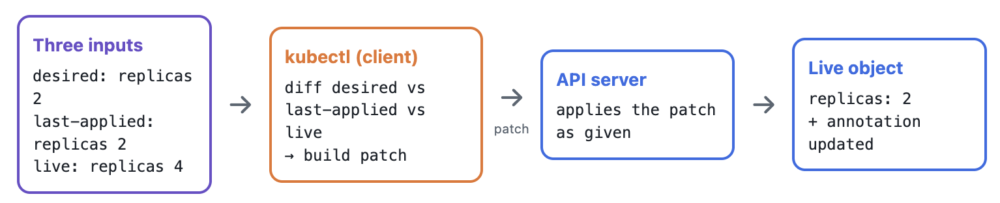
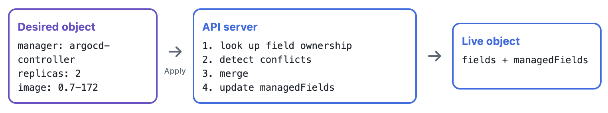
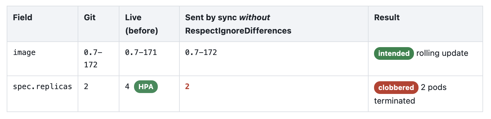
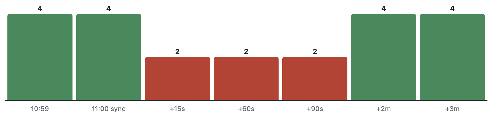
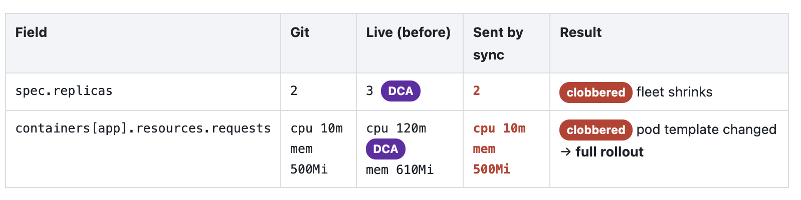
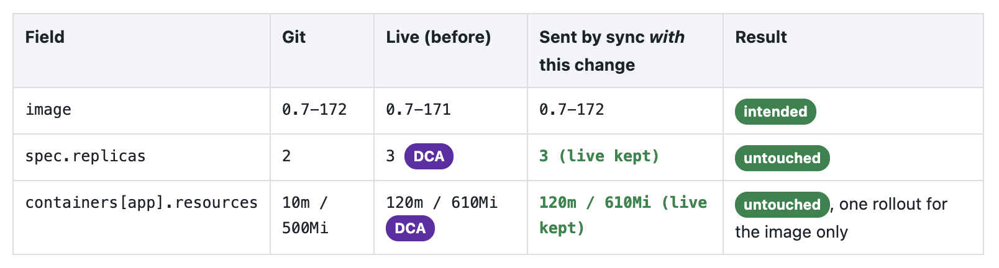

หลังจากที่ได้เล่าถึงแนวคิดในแก้ปัญหาที่เกิดขึ้นใน workload autoscaling solution สำหรับ backend API ใน Kubernetes ไปแล้ว blog นี้ก็จะมาเจาะลึกว่าแล้วการ migrate จาก solution เดิมมาเป็นของใหม่นั้นมันเป็นยังไง ไปจนถึงเจอปัญหาที่ซ่อนเงียบอยู่มาตลอด ทำให้เกิดการเรียนรู้พฤติกรรมของ Kubernetes และ ArgoCD มากขึ้น ไปดูกัน  

## ขอเล่าเรื่องพื้นฐานก่อน
เดิมทีเรามี Kubernetes workload ที่ใช้ `HorizontalPodAutoscaler` อยู่แล้ว แล้วอยากเปลี่ยนมาใช้ `DatadogPodAutoscaler` (DPA) เพื่อให้ autoscaling ทำได้ทั้ง horizontal scaling และ vertical scaling ซึ่งการ autoscaling ก็จะมีผลต่อค่าที่กำหนดใน Kuberentes ผ่าน declarative field ใน `Deployment` manifest (ซึ่งหลังจากนี้เราจะเอ่ยถึง field บ่อยมากกกกก)

- `spec.replicas` ไว้บอกว่า workload นี้จะมีกี่ pod -> เกี่ยวข้องโดยตรงกับ horizontal scaling
- `spec.template.spec.containers[].resources` -> เกี่ยวข้องโดยตรงกับ vertical scaling ซึ่งการแก้ field นี้จะทำให้เกิดการ deploy pod ใหม่

ซึ่งเราสามารถควบคุมปรับเปลี่ยนค่าของมันได้ผ่าน 2 วิธี

1. **Client-side apply**: ผ่านการ update ค่าตรง ๆ ใน manifest file



2. **Server-side apply**: ผ่าน controller ที่อยู่ภายใต้ Kubernetes เช่น HPA ก็จะมี controller ในการควบคุม field `spec.replicas` แต่จะไม่มี permission ในการควบคุม `spec.template.spec.containers[].resources` ซึ่ง DPA สามารถทำได้นั่นเอง



ซึ่ง 2 วิธีนี้มันมีการทำงานต่างกันไม่ใช่แค่วิธี แต่รวมถึง logic ในการ apply ที่ซ่อนอยู่ และจะได้ผลลัพธ์ที่ต่างกันดังนี้

|                              | **Client-Side Apply (CSA)**                                                                                | **Server-Side Apply (SSA)**                                                                                           |
| :--------------------------- | :--------------------------------------------------------------------------------------------------------- | :-------------------------------------------------------------------------------------------------------------------- |
| **ใครเป็นคน Merge**          | `kubectl` (หรือ client ตัวอื่น)                                                                            | Kubernetes API Server                                                                                                 |
| **จำอะไรไว้**                | Annotation `kubectl.kubernetes.io/last-applied-configuration` ซึ่งเป็นสำเนาของ manifest ล่าสุดที่เคย apply | `metadata.managedFields` ซึ่งบันทึกว่า manager แต่ละตัวเป็นเจ้าของ field ไหน                                          |
| **ความละเอียดของ Ownership** | ระดับ Object: "นี่คือ manifest ล่าสุดที่ฉันเคย apply"                                                      | ระดับ Field: "field เหล่านี้เป็นของฉัน และมีค่าเหล่านี้"                                                              |
| **สิ่งที่ส่งไป**             | Patch ที่ client คำนวณมาให้แล้ว                                                                            | Declarative object พร้อมชื่อของ Field Manager                                                                         |
| **การตรวจจับ Conflict**      | ไม่มี — writer คนล่าสุดสามารถเขียนทับได้โดยไม่มี conflict                                                  | ระดับ Field — ถ้า Apply พยายามเปลี่ยน field ที่ manager อื่นเป็นเจ้าของ จะถูก reject เว้นแต่จะใช้ `--force-conflicts` |
| **Object ขนาดใหญ่**          | อาจติดข้อจำกัดขนาดของ annotation ซึ่งเป็นปัญหาที่พบได้กับ CRD และ ConfigMap ขนาดใหญ่                       | ไม่มี `last-applied` annotation จึงไม่ติดข้อจำกัดนี้                                                                  |
| **เหมาะกับ**                 | Manifest เดียว, มี writer คนเดียว และ object ที่ไม่ซับซ้อน                                               | GitOps, Controller, Operator และ CRD ที่มีหลายระบบเขียน object เดียวกัน                                               |

โดยสรุปคือ Client-side apply จะมองประมาณว่า "manifest ล่าสุดที่ฉันเคย apply คืออะไร" ในขณะที่ Server-side apply เพิ่มแนวคิด "field ไหนเป็นของใคร" เพื่อบอก user ให้รู้ว่า "คุณกำลังจะทำให้พฤติกรรมของการควบคุมค่าของ field นั้นเปลี่ยนไป" ป้องกันไม่ให้เกิดการแก้ไขอย่างว่าทำให้ระบบมีปัญหาตามมา มาดูตัวอย่างกัน

---

## ตัวอย่างของปัญหาที่เกิดขึ้น
ใน Kubernetes เราไม่ได้มีแค่ autoscaler ที่เขียน Deployment

ใน environment ของเรามีอย่างน้อย 2 สิ่งที่สามารถควบคุม `spec.replicas` field ได้ นั่นก็คือ Git (ผ่าน GitOps tool) และ HPA  

Git บอกว่า

```yaml
replicas: 2
```

แต่ HPA อาจบอกว่า

```text
replicas = 4
```

คำถามคือ

> ถ้าทุกคนมีสิทธิ์เขียน object เดียวกัน แล้วใครควรชนะ

นี่คือจุดที่ GitOps กับ autoscaling เริ่มชนกัน เนื่องจากว่า GitOps มีหน้าที่ทำให้ Kubernetes object ตรงกับสิ่งที่กำหนดไว้ใน Git เสมอ ซึ่งมันจะเทียบสิ่งที่แตกต่างกันระหว่าง Git (desired state) กับ live state แล้วก็ update แค่เฉพาะส่วนที่ต่างกันเหล่านั้น  



ในเมื่อ GitOps ก็มีหน้าที่พยายามทำให้ Kubernetes object จาก live state กลับไปตรงกับ Git (desired state) ฟังดูถูกต้องมาก แต่ว่า HPA (หรือแม้กระทั่ง DPA) เขาก็มีหน้าที่เปลี่ยน live state เช่นกัน ทำให้ต่างคนต่างก็พยายามที่จะปรับแก้ `spec.replicas` field  

ซึ่งถ้าเราใช้ Client-side apply ตามสิ่งที่เราอธิบายไว้ข้างบน ตอนที่ apply change ผลคือ จำนวน replicas ก็จะเปลี่ยน 



ทำให้ autoscaler ก็ต้องกลับมาแก้ใหม่ ในระบบ production อาจส่งผลต่อ capacity ในการรับ load โดยตรงได้เลยนะครับ (ถ้าจำนวน replicas เป็นปัจจัยหลักอ่ะนะ)

### "งั้นเราบอกให้ GitOps ไม่ต้อง sync field นี้ได้ไหม"
ได้ครับ ตัวอย่างใน GitOps tool ที่เราใช้อย่าง [ArgoCD](https://argo-cd.readthedocs.io/en/stable/) เรามี configuration ประมาณนี้อยู่แล้ว ใน `Application`, `AppProject`, `ApplicationSet` แล้วแต่ว่า set มายังไง

```yaml
ignoreDifferences:
  - group: apps
    kind: Deployment
    jsonPointers:
      - /spec/replicas
```

`ignoreDifferences` โดยตัวมันเองมีผลกับ **diffing** พูดง่าย ๆ คือช่วยบอก ArgoCD ว่า

> "เวลาคำนวณว่า OutOfSync หรือไม่ อย่าเอา field นี้มาคิด"

ดังนั้น UI อาจดูเป็น **Synced** ทั้งที่ live state เป็น

```yaml
replicas: 4
```

ในขณะที่ Git เป็น

```yaml
replicas: 2
```

แต่มันไม่ได้หมายความว่า

> "ในระหว่างการ sync จริง ๆ อย่าเอา field นี้มา sync"

ด้วยความที่ ArgoCD เป็น Client-side apply โดย default นั่นหมายความว่าปัญหาก็จะยังเกิดอยู่ดี มิหนำซ้ำดันเกิดเงียบซะด้วย เพราะ `ignoreDifferences` เป็นแค่ฉากบังหน้าให้ ArgoCD report ว่า Application status ของเรา Synced แล้วแค่นั้นเอง  

## อีกตัวอย่างของปัญหาที่เกิดขึ้น
ทีนี้สมมติ DPA เรียนรู้จาก workload แล้วบอกว่า

```text
CPU request    = 120m
Memory request = 610Mi
```

ขณะที่ Git ยังมี default

```yaml
resources:
  requests:
    cpu: 10m
    memory: 500Mi
```

DPA Apply ค่าใหม่เข้า Deployment ทำให้ live state กลายเป็น

```yaml
resources:
  requests:
    cpu: 120m
    memory: 610Mi
```

ทุกอย่างดีจนกระทั่งมีคนสั่งให้ GitOps sync live state ส่งกลับไปเป็น

```yaml
resources:
  requests:
    cpu: 10m
    memory: 500Mi
```

ดังนั้นการเปลี่ยน resource ทำให้ Pod template เปลี่ยน เกิดการ redeploy อีกครั้ง ทำให้เกิดการปรับไป ๆ มา ๆ เป็น ping-pong ได้ กลายเป็นว่า deployment ของเราไม่เสถียรไปซะอย่างนั้น



---

## การแก้ปัญหาด้วยการเปลี่ยนวิธีการ apply resource ใน Kubernetes
หลายคนอ่านมาถึงตรงนี้ก็พอจะเดาได้ว่าการเปลี่ยนวิธี apply จาก Client-side apply เป็น Server-side apply จะสามารถแก้ปัญหานี้ได้ ดังนั้นเราต้องมี Server-Side Apply เพราะมันกำลังแก้ปัญหาที่เราเจอคือ

> **หลายระบบกำลังเขียน object เดียวกัน และเราต้องการรู้ว่าแต่ละระบบรับผิดชอบ field ไหน**

ใน ArgoCD ก็กำหนดค่านี้ลงไปใน `Application`, `AppProject`, `ApplicationSet` แล้วแต่ว่า set มายังไง

```yaml
syncPolicy:
  syncOptions:
    - ServerSideApply=true
```

Server-side apply เขาจะทำงานโดยไปอ่านข้อมูลที่ Kubernetes เคยบันทึกไว้เองว่า manager/controller/process แต่ละตัวเป็นเจ้าของ field ไหนผ่าน `metadata.managedFields` field ตัวอย่างเช่น

```yaml
managedFields:
  - manager: argocd-controller
    operation: Apply
    fieldsV1:
      f:spec:
        f:template:
          ...

  - manager: datadog-cluster-agent
    operation: Apply
    fieldsV1:
      f:spec:
        f:replicas: {}
        f:template:
          ...
```

ตอนนี้ Kubernetes รู้แล้วว่า

- ArgoCD ควบคุม image และ field อื่น ๆ ที่เกี่ยวข้อง
- Datadog ควบคุม replicas / resources / autoscaling annotations

และนี่ทำให้ GitOps (ArgoCD) สามารถบอกได้ว่า

> "ถ้า field นี้เป็นของ `datadog-cluster-agent` ฉันจะไม่เอาของตัวเองไปทับ"

Datadog แนะนำ `managedFieldsManagers` เป็นวิธีหลักสำหรับ ArgoCD integration เพราะสามารถ ignore ทุก field ที่ Cluster Agent เป็น owner ได้ ซึ่งดีกว่า `jsonPointers` ที่ไม่ต้องมากำหนด field เองทีละตัว เช่น `spec.replicas`, container resources และ autoscaling annotations เช่น

```yaml
ignoreDifferences:
  - group: apps
    kind: Deployment
    managedFieldsManagers:
      - datadog-cluster-agent
```

จากความหมายเดิมตาม configuration ก่อนหน้า

> "เวลาคำนวณว่า OutOfSync หรือไม่ อย่าเอา field ... มาคิด"

เปลี่ยนเป็น

> "ในระหว่างการ sync จริง ๆ อย่าเอา field ที่ Datadog Cluster Agent เป็นเจ้าของมา sync"

นี่ scalable กว่าเยอะเพราะไม่ต้องรู้ล่วงหน้าว่า DPA จะแก้ไข field ไหนบ้าง  



### Configuration ที่ต้องกำหนดลงไป

สุดท้าย ArgoCD configuration จะมีหน้าตาประมาณนี้

```yaml
syncPolicy:
  syncOptions:
    - RespectIgnoreDifferences=true # ArgoCD ไม่ส่ง fields เหล่านั้นไปตอน sync
    - ServerSideApply=true # สนใจว่าใครเป็น owner ของ field

ignoreDifferences:
  - group: apps
    kind: Deployment
    managedFieldsManagers:
      - datadog-cluster-agent # เลือก fields ที่ DPA เป็น owner
```

แต่ใน migration จริง เราไม่ได้ลบ rules เดิมทิ้งทันที เพราะตอนที่ยังใช้ HPA อยู่ HPA ไม่ได้เป็น `datadog-cluster-agent` ดังนั้นเรายังต้องรองรับ HPA ด้วย ก็จะได้หน้าตาประมาณนี้ก่อน

```yaml
ignoreDifferences:

  # HPA protection
  - group: apps
    kind: Deployment
    jsonPointers:
      - /spec/replicas

  # Existing resource protection
  - group: apps
    kind: Deployment
    jqPathExpressions:
      - .spec.template.spec.containers[].resources

  # DPA / DCA ownership
  - group: apps
    kind: Deployment
    managedFieldsManagers:
      - datadog-cluster-agent
```

แล้วค่อย cleanup หลัง migration เสร็จ

## Migration step

สิ่งที่น่าสนใจจาก migration นี้คือ จริง ๆ แล้วเราไม่จำเป็นต้องเปลี่ยนทุกอย่างพร้อมกัน

สามารถแบ่งเป็น phase ได้ ดังนี้

### Phase 1 — กำหนดให้ GitOps ใช้ Server-side apply ก่อน
จุดประสงค์คือ ทำให้ ArgoCD พร้อมที่จะอยู่ร่วมกับ autoscaler ก่อนโดยไม่เปลี่ยนการทำงานของ autoscaling เดิม สิ่งที่ต้องทำคือ Configure GitOps ตามตัวอย่างข้างบนถ้าใช้ ArgoCD 

### Phase 2 — DPA Preview

DPA อยู่ใน

```yaml
applyPolicy:
  mode: Preview
```

ดังนั้น DPA สามารถคำนวณ recommendation ได้ แต่ยังไม่ทำอะไรกับ workload

เช่น:

```text
HPA:
  4 replicas

DPA recommendation:
  3 replicas
  CPU: 120m
  Memory: 610Mi
```

เราสามารถเอาสองระบบมาเทียบกันก่อน

```text
Current HPA behaviour
        vs
DPA recommendation
```

Datadog เองก็ระบุว่าสามารถทดลอง DPA ใน `Preview` mode ขณะที่ยังมี HPA/VPA อยู่ได้ ก่อน cutover

> ขอย้ำอีกที อย่าเพิ่งลบ HPA และเปิด DPA เป็น Preview mode


### Phase 3 — Cutover

เมื่อมั่นใจแล้ว Delete HPA + DPA -> Apply

ตอนนี้ DPA กลายเป็น controller ที่ manage field แล้ว และ ArgoCD ก็จะรู้ว่า field ที่ DCA เป็น owner ไม่ใช่ field ที่ Git ต้อง enforce

### Phase 4 — Cleanup
หลังจาก DPA ทำงานจริงและ field ownership ถูก verify แล้ว ค่อยพิจารณาลบสิ่งที่ไม่จำเป็นออกจาก Git

เช่น:

```yaml
replicas: 2
```

หรือ default resources:

```yaml
resources:
  requests:
    cpu: 10m
    memory: 500Mi
```

แต่ไม่จำเป็นต้องรีบลบ

จริง ๆ แล้วการเก็บ default เหล่านี้ไว้ก็มีประโยชน์ตอน object ถูกสร้างใหม่ เพราะ `RespectIgnoreDifferences` มีผลกับ object ที่มีอยู่แล้วเป็นหลัก ตอนสร้าง Deployment ใหม่ ArgoCD ยังต้องส่ง manifest เริ่มต้นอยู่

---

## สรุป

ตอนแรกเราคิดว่าโจทย์คือ เราจะเปลี่ยน HPA เป็น VPA ยังไง กลายเป็น

> เราจะออกแบบ ownership ของ Kubernetes object ที่มีหลาย controller เข้ามาเขียนอย่างไร**

Autoscaler เป็นแค่หนึ่งในตัวอย่าง เพราะ pattern เดียวกันนี้เกิดกับ Kubernetes ในหลาย ๆ use case มาก เพราะ controller, operator, add-ons สามารถ แก้ไข object เดียวกันได้ ถ้าเราใช้ model แบบ GitOps สุดโต่ง เราจะเจอปัญหาแบบนี้ เพราะบาง field ไม่ได้มีค่าตาม Git ไปตลอดนั่นเอง

## References
- [Managing DatadogPodAutoscaler with ArgoCD](https://docs.datadoghq.com/containers/guide/manage-datadogpodautoscaler-with-argocd)
