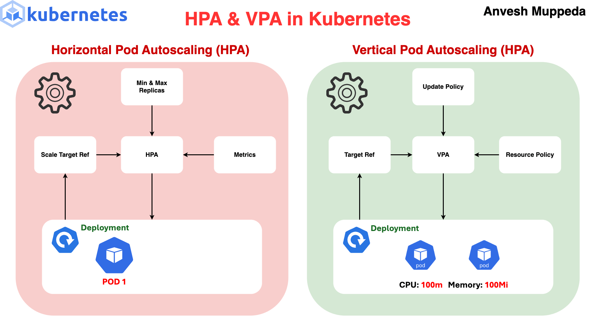
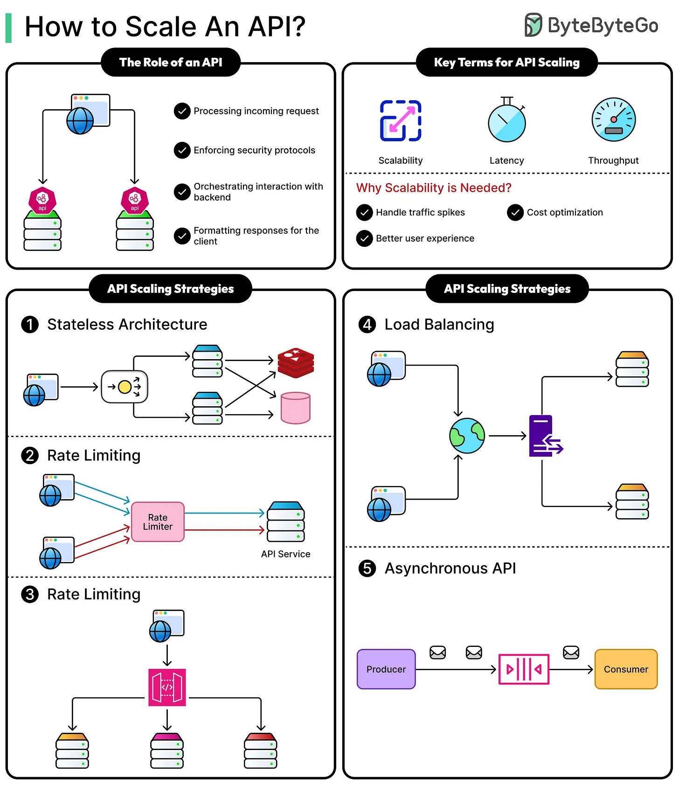

## Background

ในระบบ internal developer platform ที่เราดูแลอยู่ หนึ่งในสิ่งที่ platform ให้คือ developer สามารถนำระบบ backend API มา deploy ใน platform ผ่าน Kubernetes ได้ โจทย์แรกที่ developer ต้องเจอคือ 

> Backend service ตัวนี้ควรตั้ง CPU และ memory request/limit เท่าไหร่ ควรจะมีกี่ pod และ scale เพิ่ม-ลด ตอนไหน

<https://medium.com/@muppedaanvesh/a-hands-on-guide-to-kubernetes-horizontal-vertical-pod-autoscalers-%EF%B8%8F-58903382ef71>

ปัจจุบันเป็นหน้าที่ของ platform team อย่างเราที่จะต้องมาปรับ tune ให้ เพื่อให้แต่ละ service ใช้ resource ได้อย่างเหมาะสม ไม่ไปรบกวนคนอื่น (noisy neighbour) มากเกินไปหรือไปกระทบ resource ทั้ง cluster เลย หมายความว่าทุกครั้งที่มีการ onboard service ใหม่ เราจะต้อง

- คุยกับ developer เพื่อประเมิน traffic คร่าว ๆ ของ service ใน production
- ทำการ generate load จำลองเข้า service ผ่านการส่ง API request
- ดู resource usage, ปรับ CPU/memory request/limit, autoscaling replica/rules, deploy ใหม่ วนไป

ซึ่งขั้นตอนเหล่านี้มันเกิดขึ้นหลายรอบ กินเวลากิน effort อีกต่างหาก เพราะว่า

1. เราต้องเลือก CPU และ memory request/limit จากผลของ load test และปรับทีละรอบ ยิ่ง service มี resource usage หลากหลายรูปแบบ ก็ยิ่งต้องทดลองหลายครั้ง
2. Resource usage ที่เราเห็นจาก load test วันนี้ ไม่ได้แปลว่าจะเหมือนเดิมในอีกหลายเดือนข้างหน้า service อาจมี traffic เพิ่มขึ้น มี feature ใหม่ หรือรูปแบบการใช้งานเปลี่ยนไป ดังนั้นการปรับ tune ครั้งเดียวตอน onboarding ไม่ได้แปลว่า service จะถูก size ถูกต้องตลอดอายุของมัน
3. Backend API มีช่วง warm-up และ just-in-time compilation หลัง pod ถูกสร้างใหม่ ช่วงนั้น CPU สามารถ spike ขึ้นมาสูงกว่าปกติได้ ประเด็นคือ HPA กำลังดู CPU utilisation อยู่ จะมีการคำนวณโดยอิงจาก CPU request มันอาจตีความว่า workload กำลังต้องการ capacity เพิ่ม ทั้งที่จริง ๆ แล้วเป็นเพียง พฤติกรรมที่เกิดจากการ restart ทำให้การ load test แต่ละรอบไม่ได้สะท้อนพฤติกรรมเมื่อ workload นิ่งเสมอไป  

เป้าหมายที่เราอยากไปคือลดการเสียเวลาไปกับงานที่เป็น repetitive feedback loop ผ่านการทำ automation วิธีการแก้ก็คือใช้ [Vertical pod autoscaling (VPA)](https://kubernetes.io/docs/concepts/workloads/autoscaling/vertical-pod-autoscale/) เข้ามาช่วยนั่นเอง

## Vertical Pod Autoscaling (VPA) คืออะไร
ถ้า HPA ตอบคำถามว่า "เราต้องมี pod กี่ตัว" VPA จะตอบอีกคำถามว่า "แต่ละ pod ควรมี CPU และ memory เท่าไหร่" เมื่อ VPA observe workload ไปเรื่อย ๆ แล้วพบว่า application ใช้ resource มากกว่าที่กำหนดอย่างสม่ำเสมอ recommendation อาจขยับขึ้น เช่น (cpu: 250m, memory: 256Mi) -> (cpu: 500m, memory: 512Mi)  

VPA ดู historical resource usage แล้วสร้าง recommendation ว่า workload ควรมี resource request ประมาณเท่าไร ซึ่งจะทำงานผ่าน component 3 อันหลัก ๆ

<https://kubernetes.io/docs/concepts/workloads/autoscaling/vertical-pod-autoscale/>

1. **VPA Recommender** เป็น component ที่จะดู historical usage ของ pod แล้วคำนวณ recommendation เพื่อตอบคำถามว่า "จาก resource usage ที่ผ่านมา workload นี้ควรมี CPU และ memory request เท่าไหร่" นอกจากนั้นยังคำนวณ upper bound และ lower bound เพื่อช่วยให้ VPA ตัดสินใจว่า resource request ที่เหมาะสมควรอยู่ตั้งแต่ประมาณช่วงไหน เพราะค่า request สามารถเปลี่ยนแปลงได้ทุกเมื่อ
2. **VPA Updater** เป็น component ที่จะดูว่า pod ปัจจุบันมี resource request ต่างจาก recommendation มากพอที่จะต้อง update หรือไม่ ถ้าต้อง update และ configuration ของ VPA อนุญาตให้ทำ automated update (ขึ้นอยู่กับ update mode) ตัว Updater อาจจะ evict pod เพื่อให้สร้าง pod ใหม่ขึ้นมา
3. **VPA Admission Controller / Admission Webhook** เป็น component ที่จะปรับ resource configuration ของ pod ที่กำลังถูกสร้างให้สอดคล้องกับ VPA recommendation

## ปัญหาใหม่ตามมาจากการใช้ VPA
แต่ว่าการเอา VPA เข้ามาช่วยก็จะสร้างปัญหาใหม่ตามมาเพราะยังมี HPA อยู่ หลาย ๆ คนอ่านมาถึงตรงนี้แล้วก็อาจจะงงว่า VPA มันไปเกี่ยวอะไรกับ HPA  

ที่มันเกี่ยวกันเพราะเกิดจาก metrics ที่ HPA ใช้มีส่วนเกี่ยวข้องกับ metrics ที่ VPA ใช้ ทำให้ vertical scaling สามารถไปเปลี่ยนพฤติกรรมของ horizontal scaling ได้ ยกตัวอย่างเช่น HPA ตัวเริ่มต้นจะใช้ CPU utilisation จะมีการคำนวณโดยอิงจาก CPU request ซึ่งจะได้สูตรคือ

> CPU utilisation = CPU usage / CPU request

สมมติ backend service ใช้ CPU 500m ถ้า request = 1000m

> CPU utilisation = 500 / 1000 = 50%

ต่อมาเราปรับ tune CPU แล้วลด request เหลือ 500m

> CPU utilisation = 500 / 500 = 100%

Application ยังใช้ CPU เท่าเดิม แต่ HPA คำนวณแล้วกลายเป็น 100% ซึ่งก็จะทำให้ horizontal autoscaling ทำงานขึ้นมาได้นั่นเอง (pod scale out ออกไป)  

นี่คือปัญหาสำคัญที่ทำให้เราไม่สามารถมอง vertical autoscaling และ horizontal autoscaling เป็นสองเรื่องที่แยกจากกันได้ง่าย ๆ ตราบใดที่ horizontal signal ยังเป็น CPU/memory utilisation ที่การคำนวณขึ้นอยู่กับ request นั่นเอง  

## แก้ปัญหาโดย value solution ตามระบบที่เป็น
ถ้าเรากลับมาดูว่า CPU/memory utilisation เป็น horizontal signal ที่สมเหตุสมผลกับระบบของเราหรือไม่ ถ้าในกรณีปกติที่สอดคล้องที่สุดคือเมื่อมี traffic เข้ามามากขึ้น CPU usage มากขึ้นตามไปด้วยกันแสดงว่า CPU utilisation ก็เป็น metrics เหมาะสม  

แต่ในระบบเราอย่างที่บอกไปว่า service มีช่วง warm-up และ just-in-time compilation หลัง pod ถูกสร้างใหม่ ช่วงนั้น CPU สามารถ spike ขึ้นมาสูงกว่าปกติได้ หรือแม้กระทั่ง implementation detail ที่เปลี่ยนไป เช่นมีการ optimise code ให้กิน CPU น้อยลง ไปจนถึงการ process request นาน ๆ เลยก็ได้  

ทีนี้เรากลับมาดูที่พฤติกรรม backend service กันต่อพบว่า โดยธรรมชาติแล้วระบบต้องการ capacity เพิ่มขึ้นตามจำนวน API request (demand) ที่เพิ่มขึ้น จากตรงนี้เราก็สามารถเปลี่ยน signal จาก CPU utilisation ที่มีความไม่แน่นอนมาเป็นสิ่งที่เกี่ยวข้องกับ demand ได้ เช่น

- Requests per second
- Concurrency
- Queue depth
- Business events

ปัญหาที่ว่า vertical autoscaling และ horizontal autoscaling มันผูกติดกันก็จะหายไป เพราะ CPU utilisation ไม่ได้ผูกติดกับ demand ของระบบ นั่นก็คือการทำ horizontal autoscaling  

> ทั้งนี้ทั้งนั้นไม่ได้หมายความว่า CPU/memory utilisation เป็น metric ที่ไม่ดี (ไม่งั้น Kubernetes
> จะให้มาเป็น default ได้ยังไง) แต่ CPU/memory บอก resource consumption ขณะที่ RPS หรือ concurrency
> บอก workload demand การเลือก signal จึงควรขึ้นกับสิ่งที่ autoscaling พยายามรักษาให้ stable 
> ซึ่งในบริบทของเรา CPU/memory มันมีการเปลี่ยนแปลงจากหลายปัจจัยที่เราควบคุมได้ยาก  

ต่อมาคือแล้วจะใช้ metrics ไหน กลับมาดูที่ระบบเราก็พบว่า request ค่อนข้างสม่ำเสมอ จะมี traffic ขึ้นมาบ้างในช่วง sales แต่ละ request ใช้เวลาไม่นาน เลยคิดว่า Requests per second (RPS) เหมาะที่สุด

- Concurrency ส่วนตัวคิดว่าเหมาะกับ request ที่แต่ละอันใช้เวลานานซึ่ง RPS อาจไม่ได้สะท้อนจำนวนของ request ที่ pod กำลังถืออยู่ ณ ตอนนั้น
- Queue depth คิดว่าเหมาะกับงานที่ต้องรอ queue ซึ่งไม่ใช่โจทย์ของ HTTP API ที่เป็น synchronous อยู่แล้ว

<https://blog.bytebytego.com/p/how-to-scale-an-api>

สุดท้าย **RPS metrics ต้องนำมาหารกับจำนวน pods ณ ตอนนั้นด้วย**เพราะว่าแต่เดิมแล้ว HPA จะคำนวณ metrics จากค่าของแต่ละ pod ถ้าใช้ RPS อย่างเดียว horizontal autoscaling ของเรามีโอกาสเพี้ยนสูง  

## Implementation detail
ต่อมาเราก็มีพิจารณา solution ที่สามารถใช้ infrastructure เดิมได้ เพราะมี operational effort น้อยกว่าการเพิ่ม component ใหม่ทั้งชุด ซึ่ง solution ที่ตอบโจทย์ของเราที่สุดคือ [DatadogPodAutoscaler (DPA)](https://docs.datadoghq.com/containers/autoscaling/?tab=datadogoperator) โดยใช้
- [CustomQuery](https://docs.datadoghq.com/containers/autoscaling/?tab=horizontalcustomquery#example-datadogpodautoscaler-configurations) เป็น objective ในส่วนของ horizontal autoscaling (เมื่อไหร่ควรเพิ่มจำนวน pod)
- [PodResource](https://docs.datadoghq.com/containers/autoscaling/?tab=optimizebalance#example-datadogpodautoscaler-configurations) เป็น objective ในส่วนของ vertical autoscaling (แต่ละ pod ควรมี CPU และ memory request เท่าไหร่)

เพราะตอบทุกโจทย์ บวกกับเราใช้ Datadog เป็น observability อยู่แล้วด้วย แต่ก็แลกมากับข้อเสียใหญ่คือ  horizontal autoscaling ตั้งแต่การคำนวณไปจนถึง scaling ขึ้นอยู่กับ Datadog หมดเลย แล้วถ้าระบบติดต่อ Datadog ไม่ได้แล้วจะทำไง นอกจากนั้นยังมี[ค่าใช้จ่ายที่ให้ Datadog คำนวณอีกด้วย](https://www.datadoghq.com/pricing/list/) เพื่อให้พร้อมกับ production grade เราควรจะกำหนด

- Local fallback policies กลับมาใช้ CPU/memory utilisation (`PodResource`) แม้ว่าจะไม่ดีเท่าแบบ CustomQuery แต่ก็ไม่ได้ทำให้ autoscaling อัมพาต เพราะเราไม่ควร assume ว่า Datadog จะพร้อมใช้งานตลอดเวลา
- Scale-up ที่จะ agressive พร้อมตอบสนองต่อ demand spike ได้เร็ว และ scale-down ที่ conservative มากกว่า เพราะอาจจะทำให้จำนวน pod แกว่งไปแกว่งมาได้

ส่วนจุดตัดเกรดของ solution นี้คือ demand metric ต้องตอบโจทย์ workload นั้น ๆ อย่างที่ได้เล่าไปใน (RPS vs concurrency vs queue depth) ซึ่งถ้า metric ยังไม่ดีหรือข้อมูลยังไม่พอจริง ๆ เราสามารถเริ่มจาก DPA ที่ใช้ `PodResource` objective ได้ จากนั้นเมื่อเราเข้าใจ workload มากขึ้น ค่อยเปลี่ยน objective เป็น `CustomQuery` ทีหลังก็ได้

## Option ที่ตัดออก

### Option 1 – HPA + VPA
ตัวดั้งเดิม ใช้ signal เดิม VPA เปลี่ยน resource request ขณะที่ HPA ใช้ request เป็นส่วนหนึ่งของการคำนวณ utilisation ถ้าจะนำ VPA มาใช้ เราต้องติดตั้งและ operate controller เพิ่ม (recommender, updater, admission webhook) ดังนั้น option นี้แก้ปัญหา rightsizing ได้บางส่วน แต่ไม่ได้แก้ปัญหา metrics ที่ HPA ใช้มีส่วนเกี่ยวข้องกับ metrics ที่ VPA

### Option 2 – HPA + DatadogMetric + VPA
นี่เป็น architecture ที่สามารถแยก horizontal scaling และ vertical sizing ได้ดีขึ้น เนื่องจาก HPA จะอิงจากผลของ DatadogMetric ซึ่งเอาไว้แสดงค่า RPS metrics demand นั่นเอง แต่ข้อเสียคือ operational effort สูงขึ้น เพราะต้อง operate controller เพิ่มและต้องสร้าง DatadogMetric สำหรับแต่ละ signal และถ้า DatadogMetric ดัน pull metrics จาก Datadog server มาไม่ได้โดยสาเหตุอะไรก็ตามแต่ HPA จะไม่สามารถทำงานได้เลย ไม่มี fallback นะ

## Outcome
Output ที่เกิดขึ้นคือ จากก่อนหน้านี้ platform team มีหน้าที่ในการ

> "fine-tune resource ให้ถูก" 

ก็เปลี่ยนกลายเป็น 

> "ช่วยออกแบบ scaling policy และ demand signal ให้ถูก" 

แล้วเอาเครื่องมือมาช่วย automate การ fine-tune ซะ ทำให้ outcome ที่ได้คือ platform team มีเวลาไปดูปัญหาอื่น ๆ ที่ใหญ่กว่าได้โดยไม่เป็นคอขวดของ developer นั่นเอง
