## ก่อนออกเดินทาง

Trip นี้เกิดขึ้นโดยไม่ได้วางแผนมาก่อน ก็คือเพื่อนที่ทำงานเขาตั้งตี้ไปเที่ยวกัน 8 คนตั้งแต่ปีที่แล้ว พอดีว่าช่วงนั้นมันมีสงคราม Iran เลยมี 1 ใน 8 คนขอสละสิทธิ์ไป แล้วพอคนขาด เขาก็เลยมาชวนเรา  

ด้วยความที่เราไม่มี plan อะไร ก็ตอบตกลงแบบรวดเร็ว ไม่ต้องคิดนาน เพราะเราก็คุ้นเคยกับวัฒนธรรมบางอย่าง เช่น ฟุตบอล และอยากลองกินอาหารที่นู่นอยู่แล้ว บวกกับช่วงที่ไปใกล้ summer อากาศน่าจะไม่เย็นมาก (เดี๋ยวรู้กันว่าคิดถูกไหม)  

ประเด็นคือมีเวลาแค่ไม่ถึง 3 เดือนในการเตรียมทุกอย่างให้พร้อม ไม่ว่าจะเป็นการจองตั๋วเข้างาน (เพราะไปงานจะได้งบด้วย) โรงแรม รถไฟ เครื่องบิน Visa ฯลฯ โดยเน้นไปที่ความสะดวกและไปกับกลุ่มได้ง่าย เช่น โรงแรมก็จองใกล้กับเพื่อนแบบเดินไป 2 นาที เครื่องบินก็เน้นบินตรงเอา ซึ่งก็ทำจบอย่างรวดเร็วจนเพื่อนชม ฮ่า ๆ แต่น่าเสียดายที่การจองตั๋วบางอย่างต้องจ่ายแพงกว่าเพื่อน ๆ เพราะจองช้าหรือไม่ก็ต้องจองเดี่ยว ไม่มีคนหารด้วย  

ด้วยความที่คนในตี้เป็น hyperplanner แผนก็มีหมดแล้ว เราก็แค่ช่วย fill gap เช่น หาร้านอาหารใน Scotland ปรับเส้นทางการขับรถ และปรับแผนเที่ยว London สำหรับกลุ่มเล็ก จะได้ดูแลพี่ ๆ ได้ด้วย  

การจัดกระเป๋าก็ไม่ต้องซับซ้อนหรือเอาไปเผื่อเยอะ เอาไปขาด ๆ แล้วไปซื้อที่นู่น และเผื่อที่ไว้สำหรับของฝากกลับไทยด้วย  

อีกหนึ่งอย่างที่ต้องเตรียมตัวคือ app ที่เพื่อนแนะนำให้ใช้ เช่น Uber (เรียกรถ), Tricount (จัดการเงินของตี้), Bounce (ฝากกระเป๋า), Citymapper (ดูการเดินทาง), Forest (เช่าจักรยานไฟฟ้า), Laundryheap (ซักผ้า)

---

## Day 0 — Bangkok → London

เริ่มออกเดินทางไป London ด้วยการบินไทย แปลกใจมากที่อาหารการบินไทยอร่อยเมื่อเทียบกับสายการบินอื่น ๆ

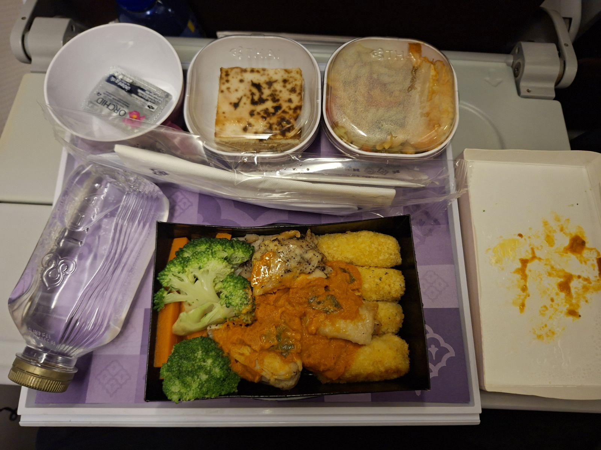

ออก 12:45 เวลาไทย ถึง 19:00 เวลาอังกฤษ แต่กว่าจะได้เข้าโรงแรมก็ปาไป 4 ทุ่มกว่า เพราะรอ flight เพื่อนที่ delay แล้วก็ landing กันคนละ terminal ต้องนั่ง shuttle train ไป ๆ มา ๆ เรียกรถ Uber ก็ต้องไปรออีกที่หนึ่ง เพราะเข้าที่จอดรถหน้าทางออก terminal ไม่ได้  

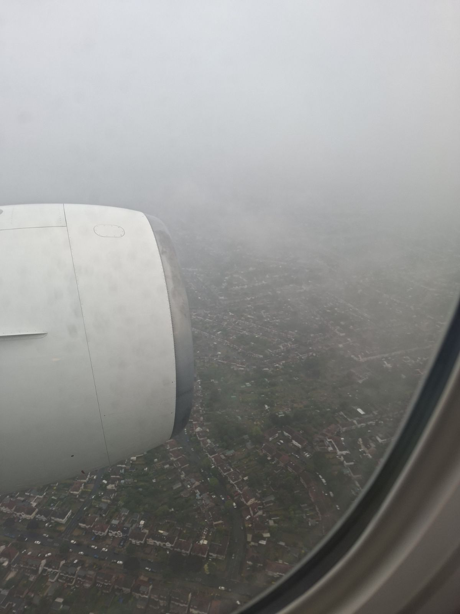

สิ่งที่ shock อย่างแรกคือพระอาทิตย์ตกช้า กว่าจะตกก็ปาไป 3 ทุ่มกว่า ดังนั้นตอน landing ก็ยังมีแสงอยู่ แม้ว่าฝนจะตกก็เหอะ

---

## Day 1 — Little Venice → Notting Hill → Hyde Park → Oxford Street

วันแรก ด้วยความที่ชีพจรลงเท้า สิ่งแรกที่ทำก่อนเลยคือ **วิ่ง!**

ก่อนหน้า trip ได้ดู route วิ่งใกล้ ๆ โรงแรมไว้ ซึ่งฝนไม่ตก อากาศสดชื่นมาก พื้นฟุตบาทเรียบดี แล้วก็มีคนวิ่งอยู่เรื่อย ๆ ด้วย ที่นี่คนวิ่งออกกำลังกายกันตลอดวัน แดดออกฝนตกเอาหมด

หลังจากนั้นก็เริ่มเดินทางไปกับกลุ่มที่ Little Venice กินข้าวที่ Clifton Nurseries Cafe บรรยากาศร้านขายต้นไม้ดอกไม้สบาย ๆ จิบชา English Breakfast Tea กับ brunch อร่อย ๆ และเดินเล่นในสวนและริมน้ำไปจนถึง Notting Hill แล้วไปถึง Hyde Park นั่งกิน Scone จากนั้นก็เลยไปที่ Oxford Street

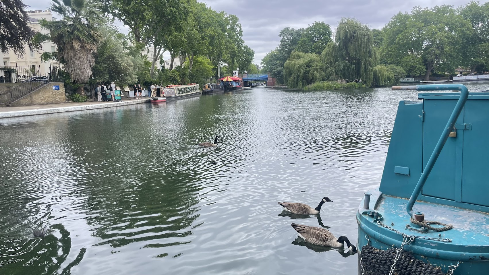

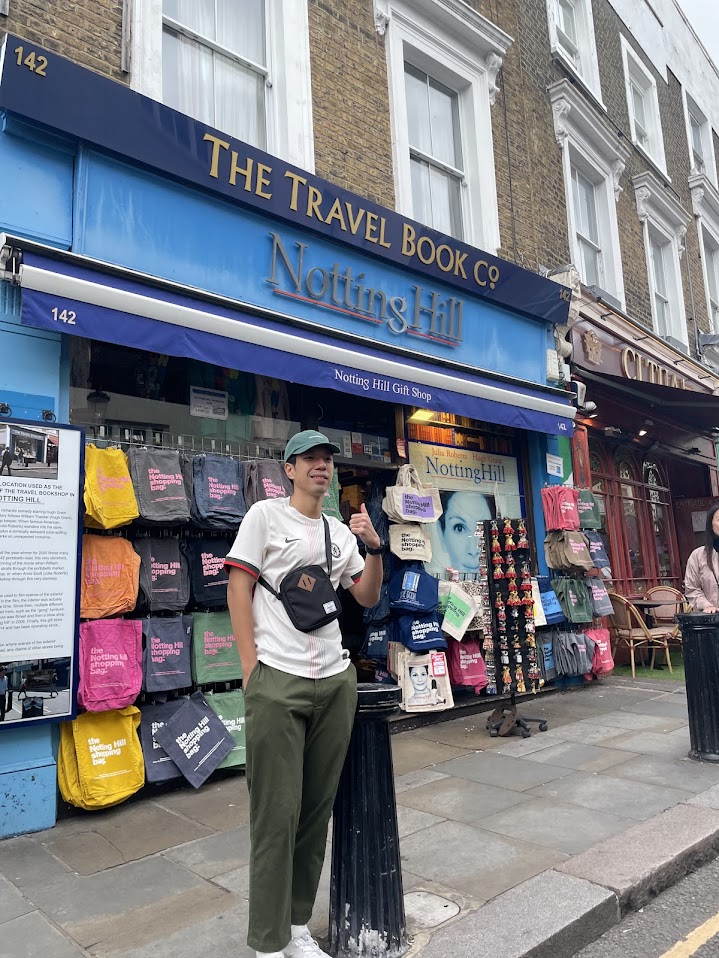

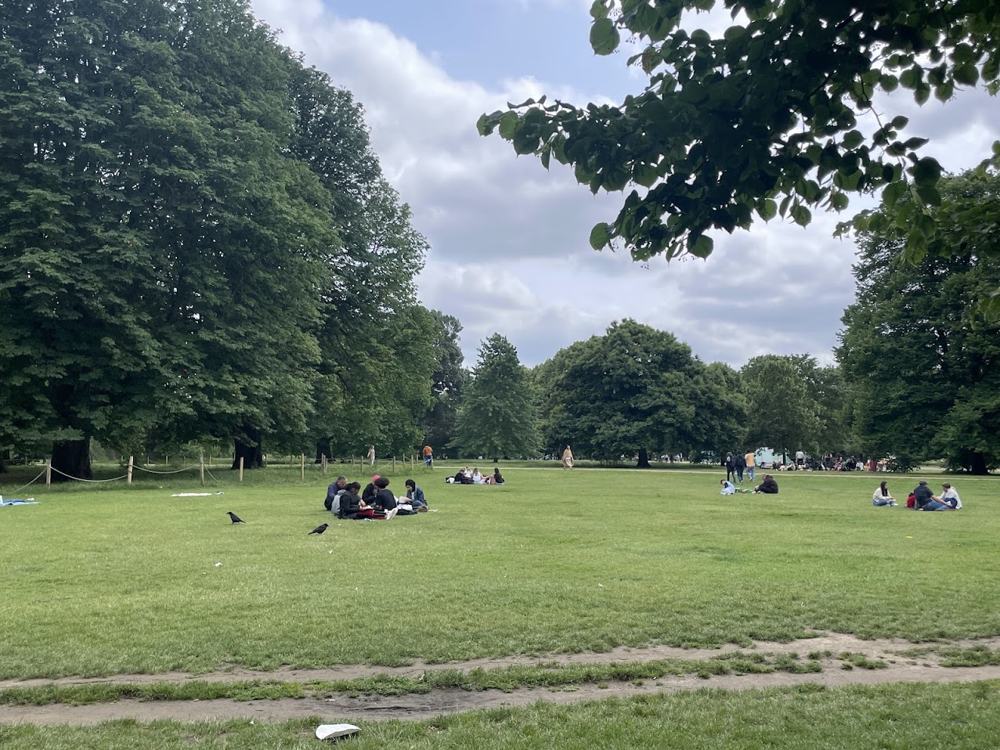

เราไปซื้อของฝากที่ Selfridges แล้วปิดวันด้วยการกินข้าวเย็นที่ Mercato Mayfair

---

## Day 2 — London Tech Week → British Museum → Canary Wharf

เปิดวันที่ 2 ด้วยการนั่งรถ bus ไปที่ Olympia เพื่อเข้า London Tech Week

โดยรวมก็คือตาม trend ล่าสุดของ tech product ที่ wrap AI ไว้ หรือไปต่อกับ AI เช่น ElasticSearch ทรงก็คล้าย ๆ งานที่ไทย คือเน้นคุยแล้วก็แจกของ แน่นอนว่าได้มาเพียบ

เพื่อน ๆ แซวว่าเพราะไปถามคำถามเขาแบบยาก ๆ (ยากตรงไหน!)

แต่ที่แจ่มกว่าคือ AWS ที่มีแจก luggage tag และน้ำผลไม้ปั่น ตรงนั้นคนโคตรเยอะ ฮ่า ๆๆ

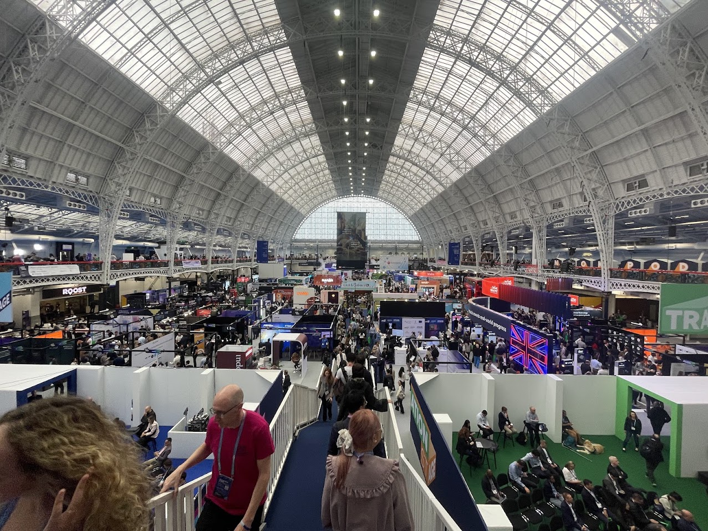

จากนั้นเราก็ออกจากงาน Tech Week ไปซื้อข้าวกลางวันกินไว ๆ ที่ Pret A Manger แล้วก็เดินเลยมานั่งกินที่สวน St Paul's Garden ใกล้ ๆ บรรยากาศชิลดีหลังฝนตก

จากนั้นเรานั่งรถ Uber ไปต่อที่ British Museum แล้วก็เดินชมสิ่งก่อสร้างและสิ่งของที่อังกฤษไปยึดมาในช่วงล่าอาณานิคมแล้วก็มาเปิดให้คนดู ไล่ไปตั้งแต่ยุคอียิปต์จนถึงปัจจุบัน

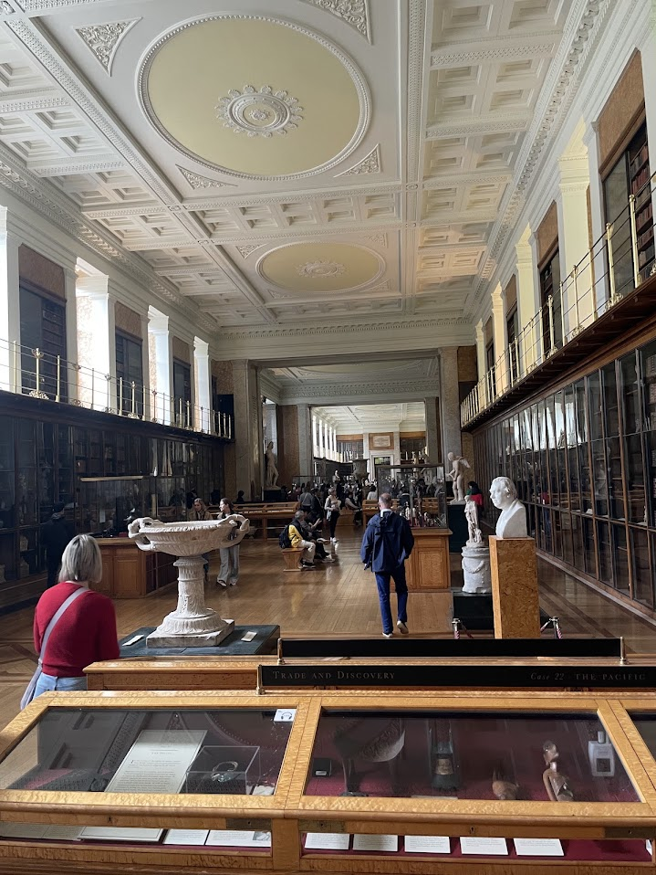

เดินเสร็จหิว เลยหาของกินแถว ๆ Chinatown เดินผ่านโรงละคร Les Misérables แต่เขาไม่ให้เข้าไปซื้อ merchandise เขาให้คนที่เข้าไปดูเท่านั้น (นั่น มีตังค์ก็เข้าไม่ได้นะครับ ฮ่า ๆๆ)

ไม่เป็นไร ก็ไปกินข้าวที่ Gold Mine รสชาติเป็ดเหมือน MK มากกก แต่ทีเด็ดคือพนักงานร้านที่ฟังคำว่า **"เก๊กฮวย"** ออก

คือกำลังคุยกันว่าจะสั่งอะไร พอพูดปุ๊บเขาทวนกลับมาได้ งงเลย เลยจัดชาเก๊กฮวยมาดื่มแบ่งกันไป

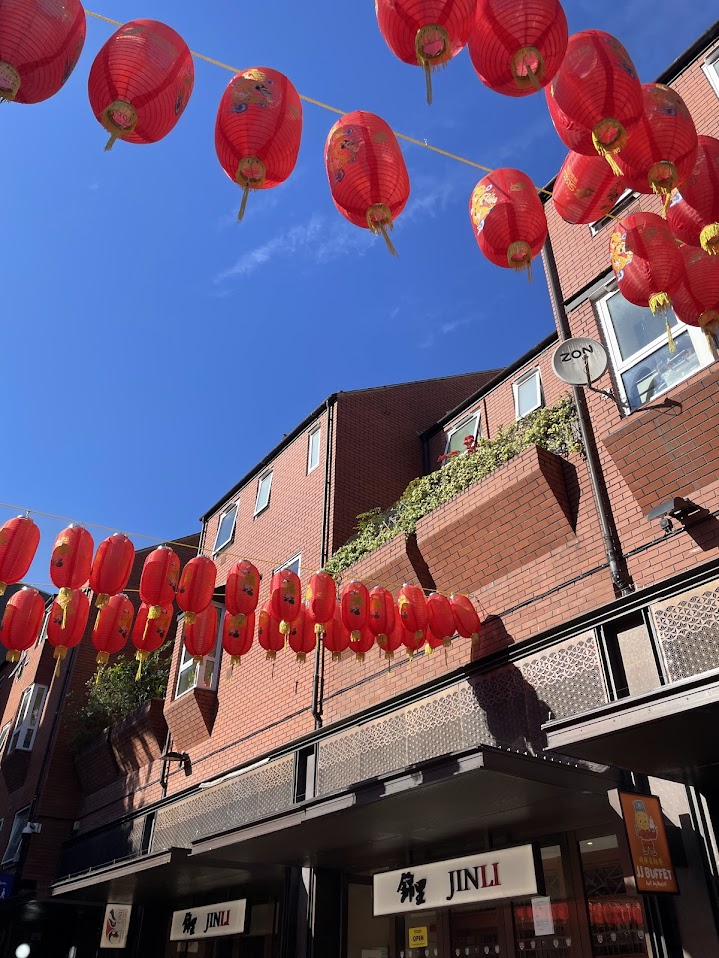

ปิดท้ายด้วยเดินชมวิวที่ Neal's Yard แล้วก็ขึ้นรถไฟไปนั่งเรือชมวิวสองฝั่งแม่น้ำ Thames ที่ Canary Wharf บรรยากาศดีมาก เข้าใจว่าแถวนี้เป็นย่าน business district ใหม่ ยังไม่ค่อยมีคนเท่าไร

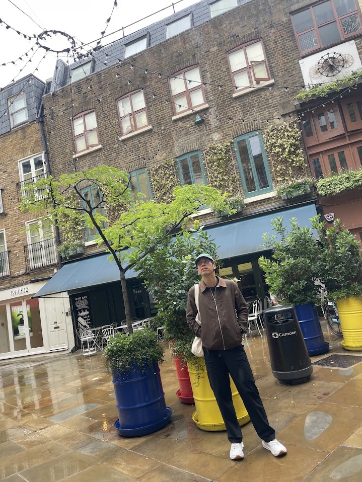

ก่อนนั่งเรือ ระหว่างรอเรือ เราก็ไปเช่าจักรยานไฟฟ้าขี่ ถีบบันไดไปครึ่งรอบแม่งพุ่งไป 20 km/h คุมไม่ค่อยอยู่ เข้าใจละว่าถ้าที่ไทยระวังมอเตอร์ไซค์ฉันใด ที่นี่ก็ต้องระวังจักรยานเช่นนั้น ปั่นกันเร็วชิบหาย ฮ่า ๆๆ

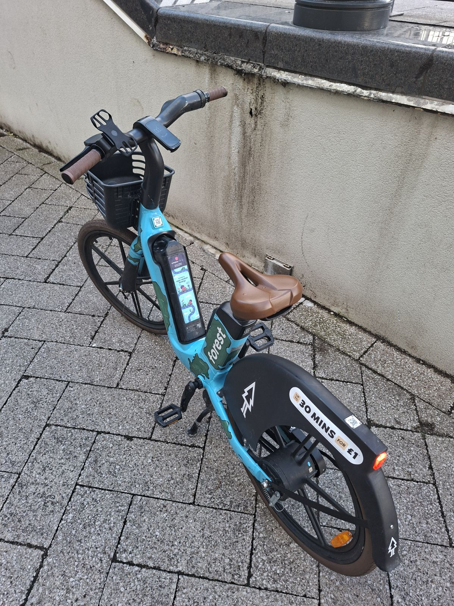

กลับมาที่เรือ วิวคือสวยมาก พระอาทิตย์กำลังจะตก เห็น landmark สองฝั่งทั้ง Tower Bridge, London Eye, Tower of London, MI6, Parliament, St Paul's Cathedral แล้วมาจบที่ Battersea Power Station

เรียกได้ว่าเก็บเกือบครบ ทำให้การเที่ยว London ในวันอื่น ๆ จากนี้มัน flexible มากขึ้น

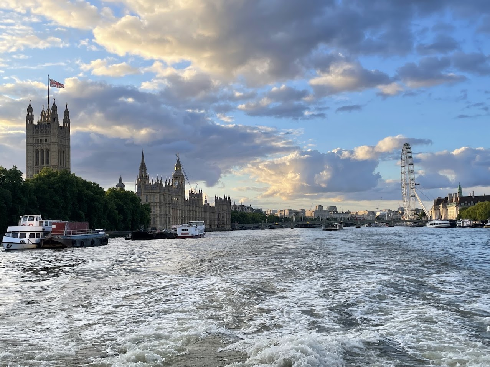

---

## Day 3 — London Landmarks → Chiswick

วันที่สาม เราแวะกินข้าวเช้า Full English Breakfast + English tea

จากนั้นก็ไปชะโงกทัวร์ที่ London Eye, Big Ben, Borough Market (คนเยอะชิบหาย), Tower of London, Tower Bridge

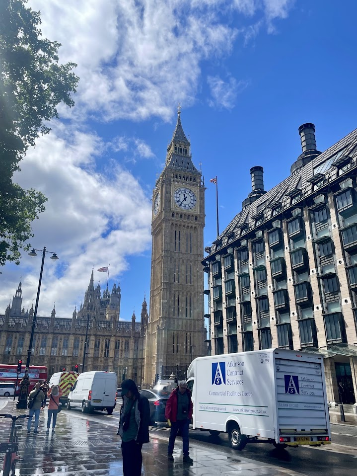

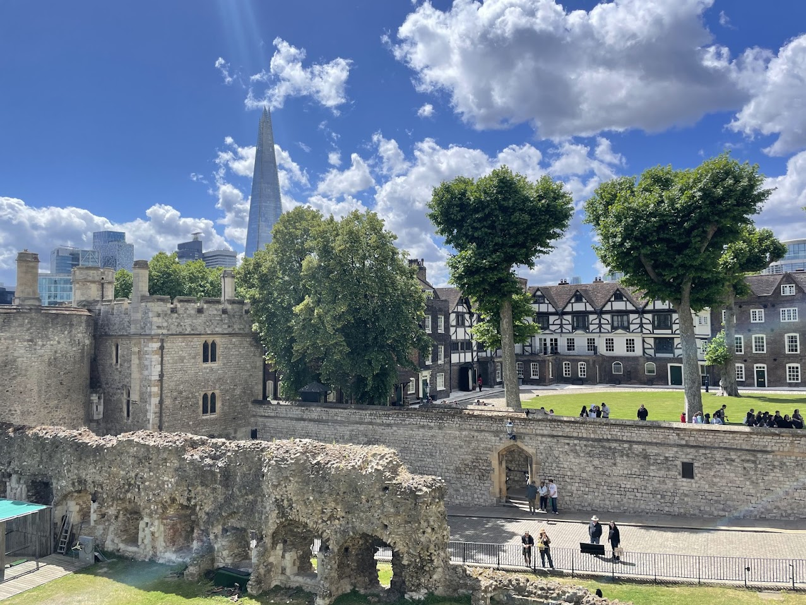

ปิดท้ายด้วยการไปเดินเล่นที่ Chiswick Park

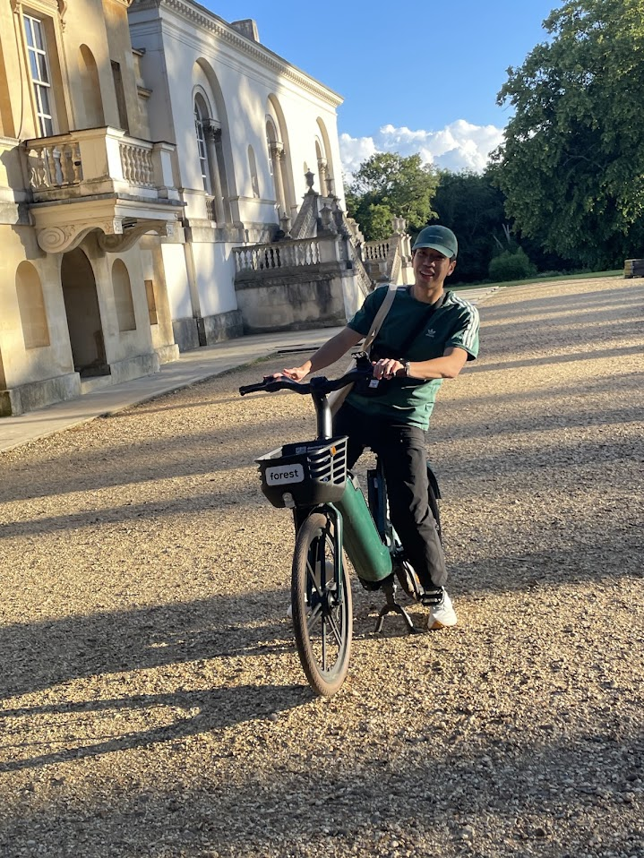

---

## Day 4 — Cotswolds

วันที่สี่ ออกเดินทางไป Cotswolds กับทัวร์ชื่อ Ollie เคยเป็นนักร้องแต่ไม่รุ่ง เลยผันตัวมาเป็น tour guide

แต่ก่อนหน้านั้นเราก็แวะไปเดินเล่นในสวน (อีกแล้ว) แถว ๆ Kensington เดินผ่าน Royal Albert Hall ส่วนเราไปขี่จักรยานไฟฟ้าต่อ

แน่นอนว่าไม่ได้กินลมชมวิวมากมาย เพราะมัวแต่หลบจักรยานคันอื่นที่ปั่นโคตรเร็ว มีจังหวะหนึ่งเข้าไปปั่นในเลนรถยนต์ โดนบีบแตรอีก

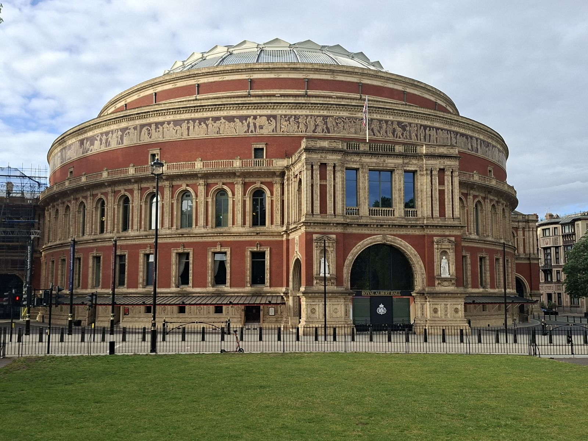

ออกเดินทางไป Cotswolds ได้ความรู้ว่าสมัยก่อนเขาใช้หินปูน (Limestone) ในการก่อสร้าง และถ้ามีการบูรณะหรือสร้างใหม่ ก็จะต้องใช้หินปูนและคงวิธีการก่อสร้างไว้เหมือนเดิม

มีแวะไปดูโบสถ์เก่าที่ Burford แวะ Bibury ชะโงกทัวร์ตรง Arlington Row แล้วก็แวะกินข้าวเที่ยงที่ Bourton-on-the-Water ที่มีลำธารใสไหลผ่านกลางเมือง

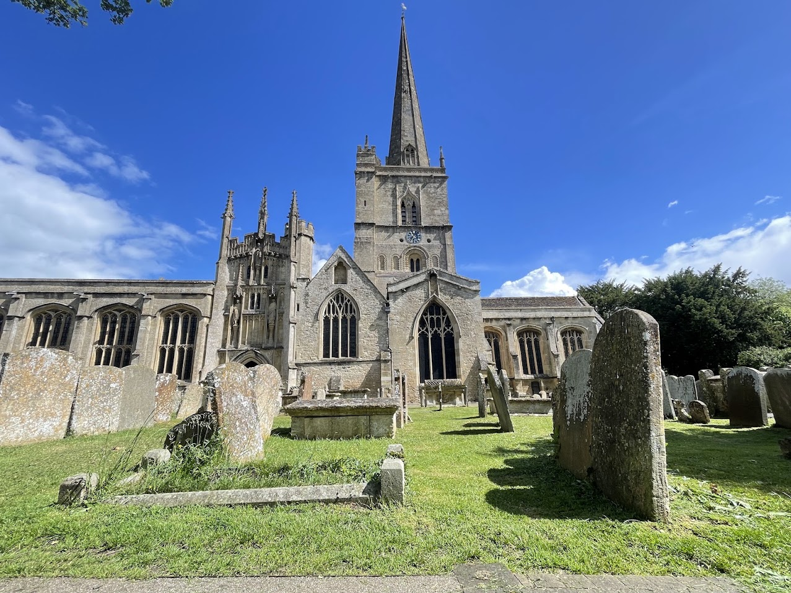

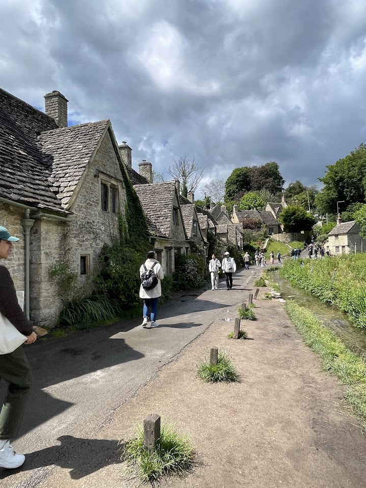

อันนี้เสียดายไม่ได้เดินเยอะ เน้นกินข้าว English pub first time ที่แต่ละเมนูเหมือนจะเค็ม แต่ทำยังไงให้มันจืดได้วะ ฮ่า ๆๆ กับเล่นเกมเอาเหรียญไปวางบนเลมอนลอยน้ำโดยไม่ให้เหรียญตก ฮ่า ๆๆ

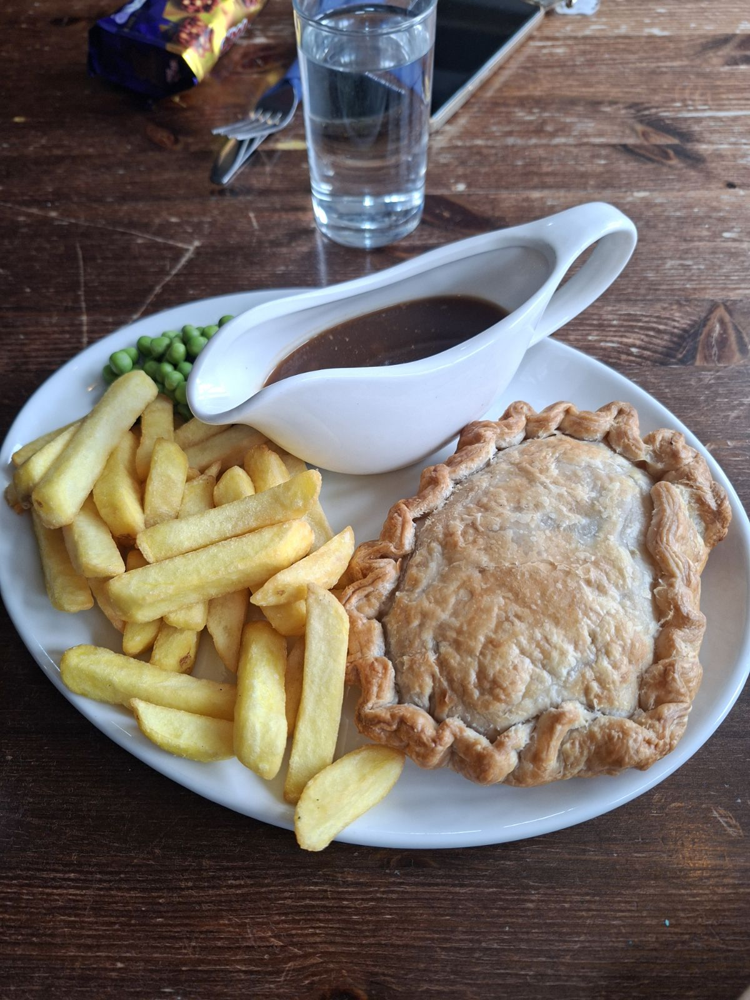

ปิดท้ายด้วยแวะกินไอติม + เดินเล่นที่ Stow-on-the-Wold ที่มีจุดถ่ายรูปกับประตูโบสถ์ที่มีต้นไม้อยู่ข้างประตูสองฝั่งพอดี

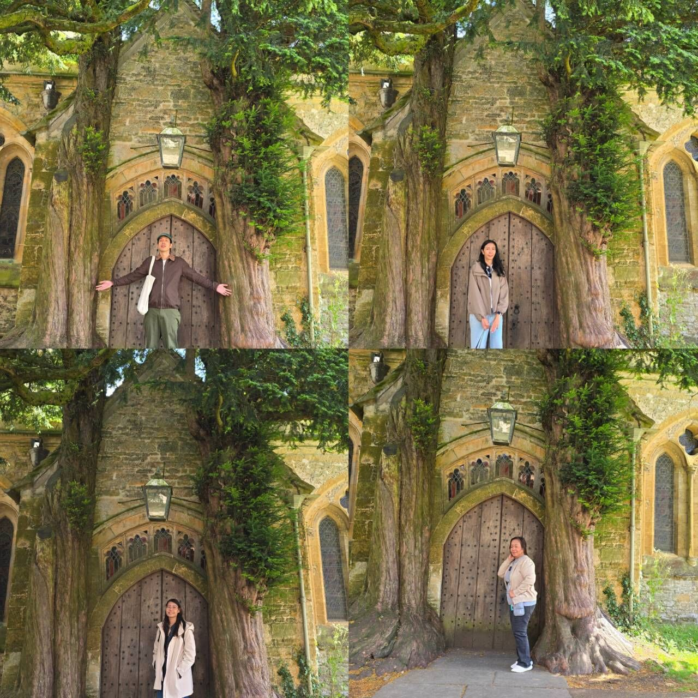

กลับ London ไปกินอาหารญี่ปุ่นที่ Wasabi (ใครชอบแบบดั้งเดิม หนีไป ฮ่า ๆๆ)

ปิดท้ายด้วยการซื้อของฝากที่ห้างเก่าแก่ Harrods ที่เขาว่าไปทีไรต้องเจอคนไทย (แล้วรุ่นพี่ก็ไปเจอจริง ๆ ฮ่า ๆๆ)

---

## Day 5 — Greenwich

วันที่ห้า แวะกิน Full English Breakfast อีกแล้วใกล้ ๆ โรงแรม เจ้านี้อร่อย ไม่มันเท่าร้านก่อนหน้า

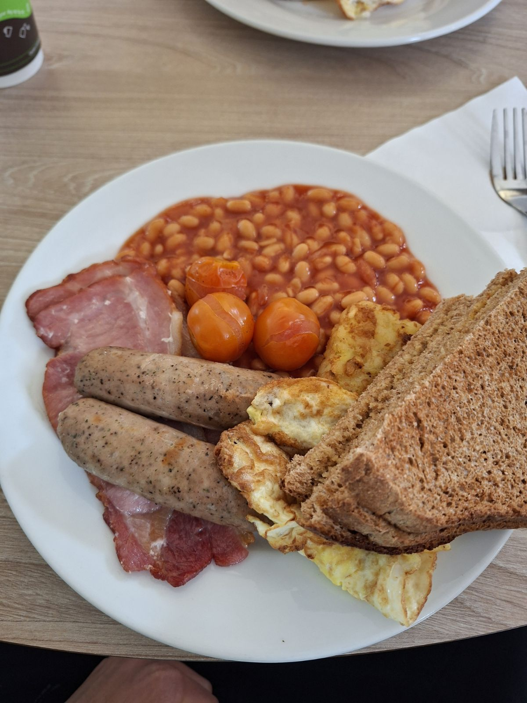

แล้วเราก็ออกเดินทางไป Greenwich เริ่มด้วยการไปชมจิตรกรรมห้องโถงที่ Painted Hall ซึ่งเดิมเคยเป็นห้องรองรับของทหารผ่านศึกมาก่อน โดยภาพวาดจะเน้นในเรื่องของการยกย่องราชวงศ์อังกฤษและทวยเทพต่าง ๆ

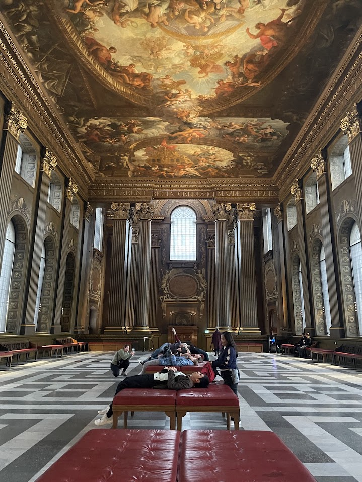

ต่อมาก็เดินชม Naval College โดย highlight ก็จะเป็นโบสถ์และ bowling ที่เคยเป็นคุกเก่ามาก่อน

แวะกินข้าวเที่ยงและซื้อของฝากที่ Greenwich Market จากนั้นก็ไปเดินชมงานศิลปะใน Queen's House แบบเทสดี

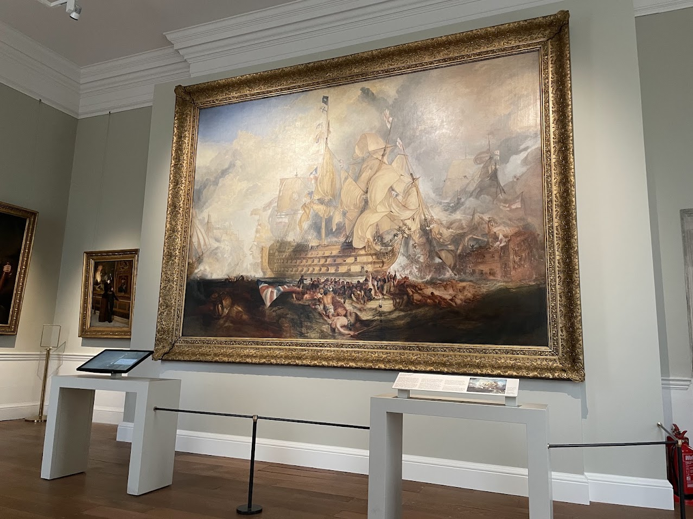

ต่อด้วยชะโงกอยู่ข้างนอกของ Royal Observatory ที่เราจะพอเห็นเส้นแบ่ง Meridian Line ได้พอดี

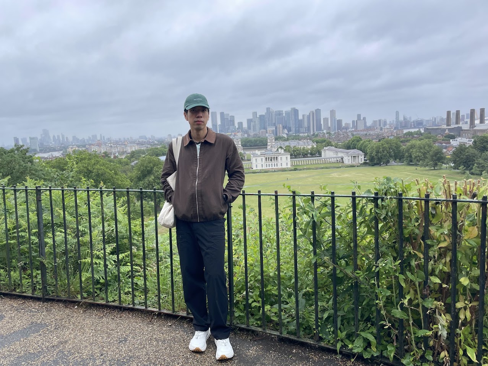

วันนี้ฝนตก บรรยากาศเดินเล่นแบบชิลดีมาก

จบตรง Greenwich ก็ไปกินข้าวเย็นและซื้อของฝากที่ O2 Arena ที่ร้าน Marugame Udon ที่เคยมาเปิดที่ไทย เพราะว่ามันใกล้กับจุดต่อไปก็คือ London Cable Car

นั่งข้ามแม่น้ำ Thames วิวสวยมาก ติดตรงที่กระจกตู้ cable car สกปรก ฮ่า ๆๆ

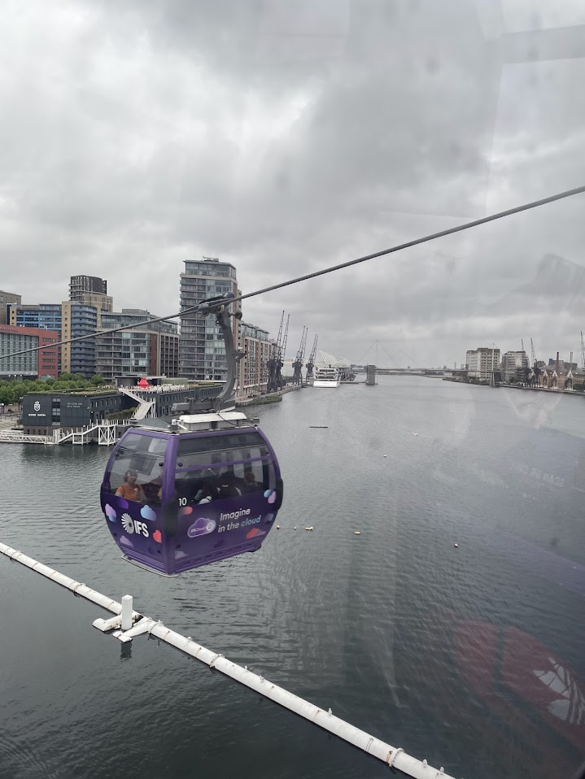

---

## Day 6 — London → Edinburgh

วันที่หก ออกเดินทางจาก London ไป Edinburgh ด้วยรถไฟ เพราะต้องทำเวลาเลยต้องพึ่งพา Greggs เพื่อนยากอีกรอบ

ที่สถานีเขามีร้านขายของ Harry Potter คนต่อคิวเต็มเลย

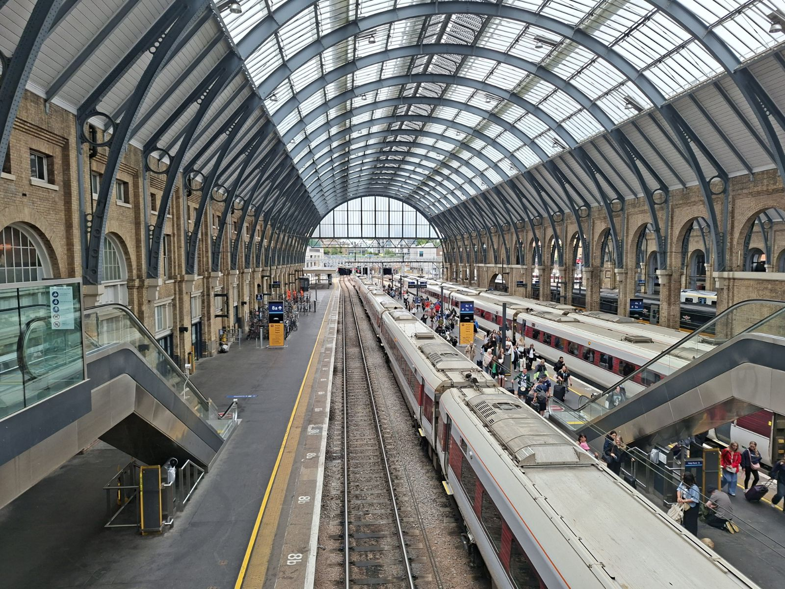

ล้อรถไฟหมุนชมวิวสองฝั่งเป็นทุ่งหญ้าและบ้านคน ผ่าน York, Newcastle ก่อนจะถึง Edinburgh ซึ่งระหว่างทางก็จินตนาการไปไกลว่า road trip จะเป็นยังไงน้อ

ในขณะเดียวกันก็ได้ปรับหูตัวเองเข้ากับ Scottish accent แบบเน้น ๆ เพราะคนข้าง ๆ เป็นป้าที่มากับหลาน ๆ เสียงดังมาก แถมอีกมานั่งเบียดกูอีก ฮ่า ๆๆ

พอถึงสถานีก็นั่ง tram เข้าที่พักที่เป็นหอพักนักศึกษา ที่งุนงงกับวิธีการใช้ heater มาก เปิดเท่าไรก็ไม่ติดสักกะที ที่ไหนได้มันจะทำงานตอนที่อุณหภูมิห้องมันเย็นกว่าที่มันกำหนด

ไม่เป็นไร ก็เรียนรู้กันไป

เสร็จแล้วเก็บของออกไปกินข้าวเย็น โดยรอบนี้จะเป็นร้านอาหารจีน

ปิดท้ายด้วยการเปลี่ยนชุดออกไปวิ่งชมบรรยากาศในเมือง คือสวยมาก ชมวิวพระอาทิตย์ตกดินบน Calton Hill

กลับมา World Cup 2026 กำลังเตะพอดี แวะดูนิดนึงก่อนนอน

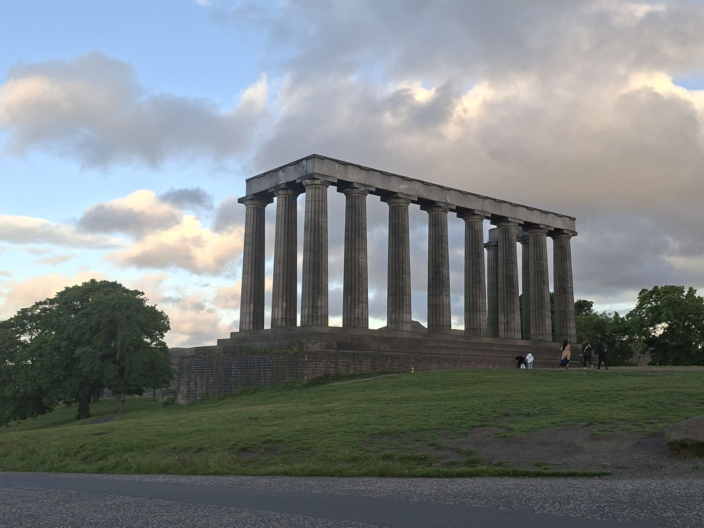

---

## Day 7 — Edinburgh → Inverness

เริ่ม road trip Highlands

เดินไปรับรถที่เช่าที่ SIXT ด้วยความที่ไปกันเยอะ + กระเป๋าใหญ่ ทางพนักงานเขาแนะนำว่าแทนที่จะเช่า SUV 2 คัน ก็เช่ารถตู้ MPV คนเดียวไปเลย ถูกกว่า แถมยังไม่ต้องกลัวหลงจากกันระหว่าง road trip ด้วย ซึ่งเราก็เอาตามนั้น

พอไปเอารถมาก็พบว่าใส่กระเป๋าได้ไม่ครบ เลยต้องกลับไปเปลี่ยนรถใหม่อีกรอบที่ใหญ่กว่าแต่ model โบราณกว่า — Mercedes-Benz Vito Tourer

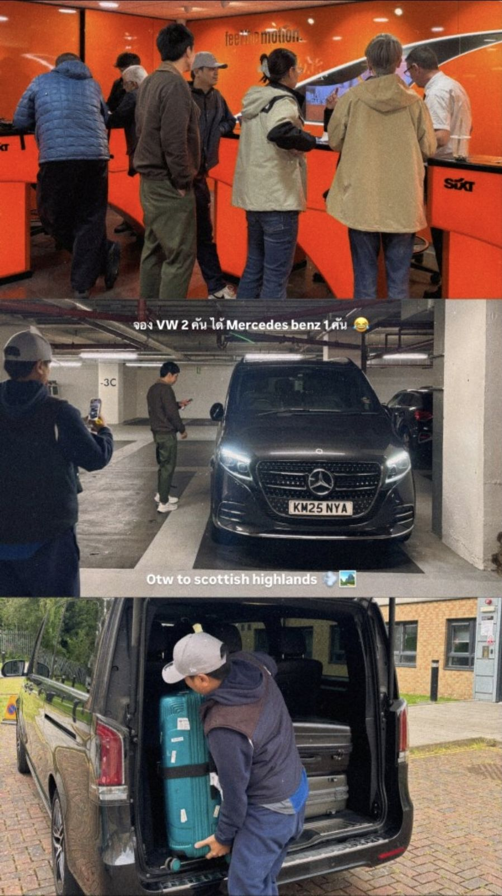

เราในฐานะคนขับก็กังวลว่าจะขับรถใหญ่ไหวไหม แต่พอปรับตัวได้ในเมือง โอเค มันก็ไม่ยากนี่หว่า อาจจะด้วยความที่เราชินกับรถยกสูงของเราที่ไทยอยู่แล้วก็ได้มั้ง

กลายเป็นว่าเราสามารถพาเพื่อน ๆ ไป enjoy trip ได้ยาว ๆ เลย (คือผลัดกันขับกับอีก 2 คน แต่ส่วนใหญ่คือเรา) ก็ภูมิใจในตัวเองมาก ๆ

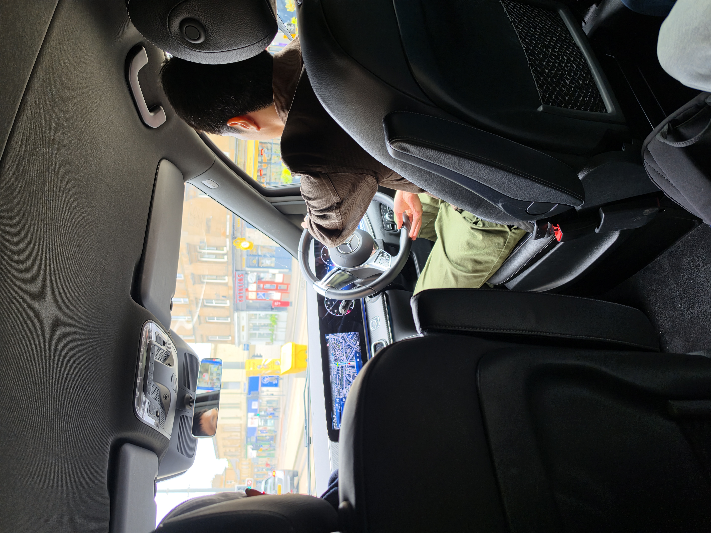

กลับมาที่ trip ออกเดินทางไป Inverness แวะกินข้าวที่ The Bothy Braemar ก่อน เป็นคาเฟ่บรรยากาศชิล ๆ มีลำธารให้ดูสบาย ๆ อาหารก็อร่อยด้วยนะ

ระหว่างทางก็แวะถ่ายรูปตามจุดชมวิวไปเรื่อย ๆ มีจุดหนึ่งตอนลงจากรถมาคือลมแรงทะลุทุก layer หนาวสั่นจนต้องไปยืนหลบลมข้าง ๆ รถ ไม่ไหว ฮ่า ๆๆ

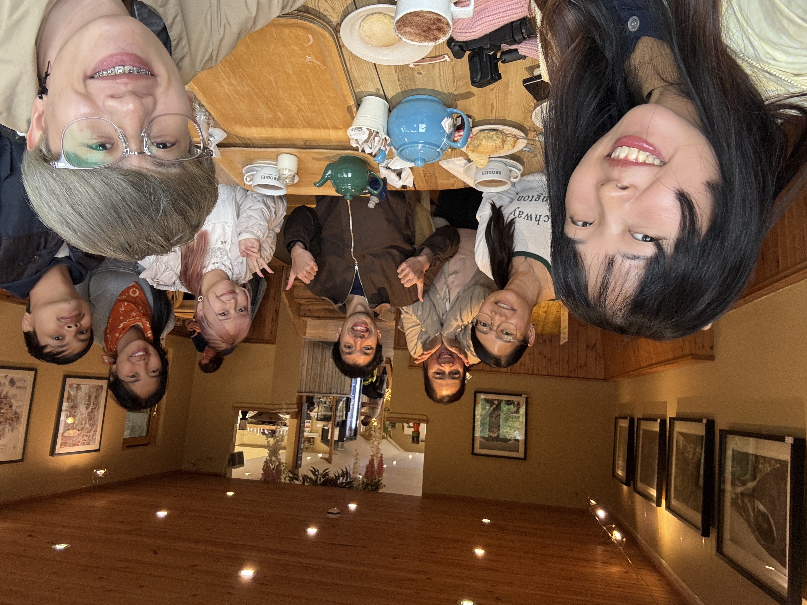

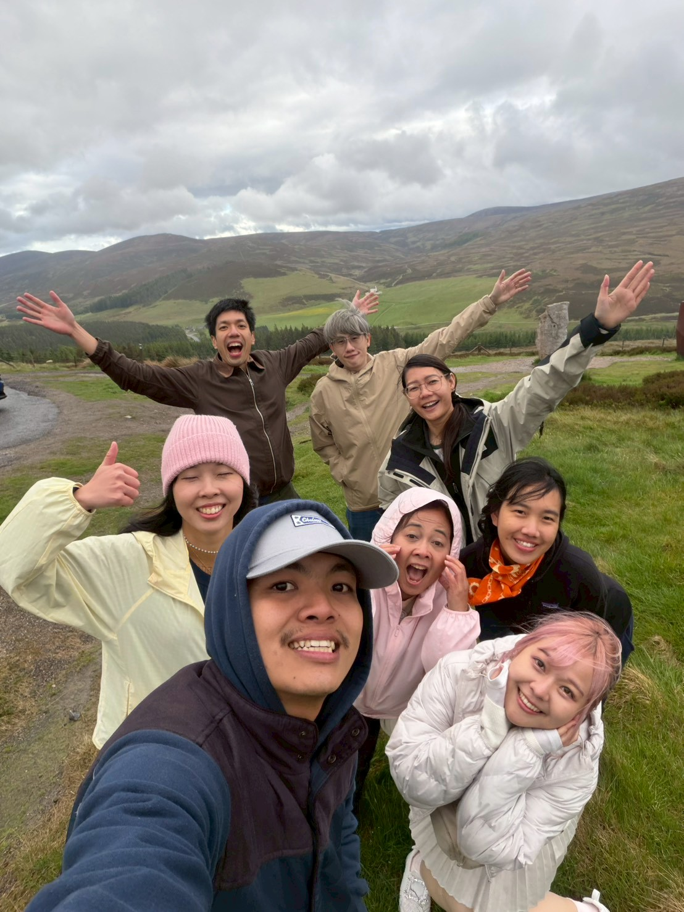

แล้วก็เข้าที่พัก Airbnb ที่ Boat of Garten

กว่าจะหาที่พักเจอคือขับวนไปวนมา + ส่งคนลงจากรถไปเดินหา สุดท้ายก็เจอ ที่หานานเพราะเจ้าของบ้านส่งรูปหลังบ้านมาให้แทนที่จะเป็นหน้าบ้าน เอ้อ เอาที่สบายใจ

ที่น่าสนใจคือตอนเข้าบ้าน เราจะต้องแกะรหัสผ่านการไขกุญแจเหมือนเล่นเกมโจรปล้นธนาคารอะไรทำนองนั้น เข้าใจว่าถ้าเขาเปลี่ยนเป็นระบบไฟฟ้าก็จะต้องรื้อโครงบ้าน ซึ่งหลาย ๆ คนก็ไม่อยาก แถมเป็นสีสันเล็ก ๆ ด้วย

ส่วนข้าวเย็นก็แวะ Tesco เอา เพราะร้านอาหารที่นี่ปิดเร็ว ถ้าเป็นเสาร์-อาทิตย์ก็ต้องจองมาก่อนด้วย จะเดิน walk-in ไปกินเหมือนที่ไทยไม่ได้จริง ๆ นะ

---

## Day 8 — Inverness → Loch Ness

วันที่แปด ออกเดินทางจาก Inverness ไป Loch Ness ก็เหมือนเดิม คือขับชมวิวและก็แวะถ่ายรูป

บอกเลยว่าสวยทุกจุด

สิ่งที่ชอบนอกจากวิวคือกฎจราจรที่ลดการเกิดอุบัติเหตุเมื่อต้องวิ่งบนถนนเลนเดียว เพราะเขาจะมีจุดให้ชิดหลบด้านใดด้านหนึ่ง บางจุดก็จะมีสัญญาณไฟทั้งอัตโนมัติและอัตโนมือ ทำให้ไม่ต้องเดาใจกันว่าใครจะไปก่อน-หลัง ประทับใจมาก

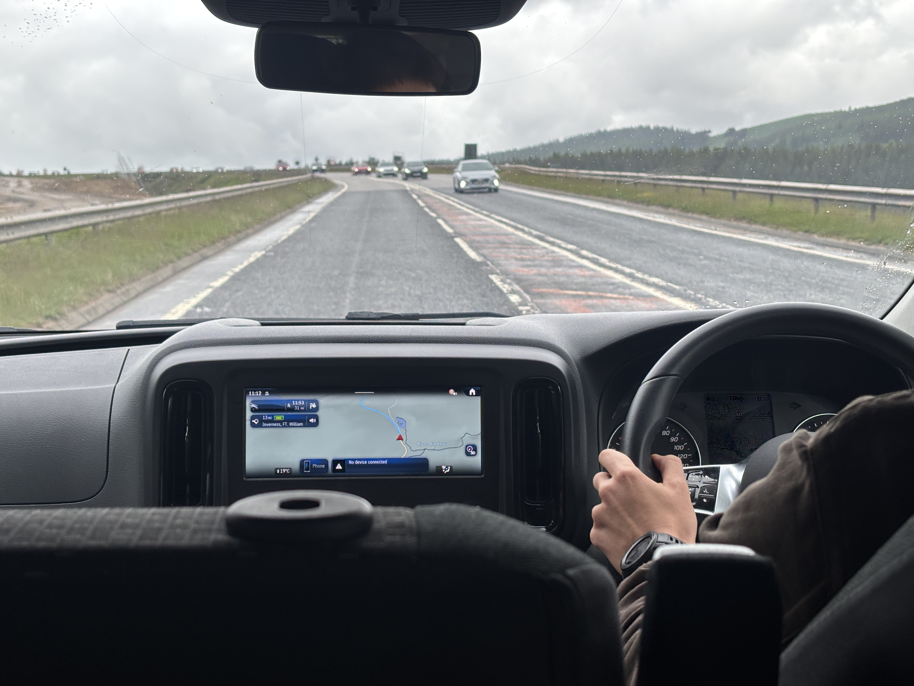

แล้วก็แวะชะโงกทัวร์ที่ Urquhart Castle ที่ต้องเสียค่าเข้าชมก็เลยไม่เสีย ฮ่า ๆๆ

กินข้าวเที่ยง Fish & Chips ที่ Dores Inn ริมทะเลสาบ แหม่ อยากลงไปเล่นน้ำเหลือเกิน

ความพิเศษของทะเลสาบที่นี่คือมันลึก ทำให้เวลาถ่ายรูปน้ำมันจะออกสีเข้ม ๆ

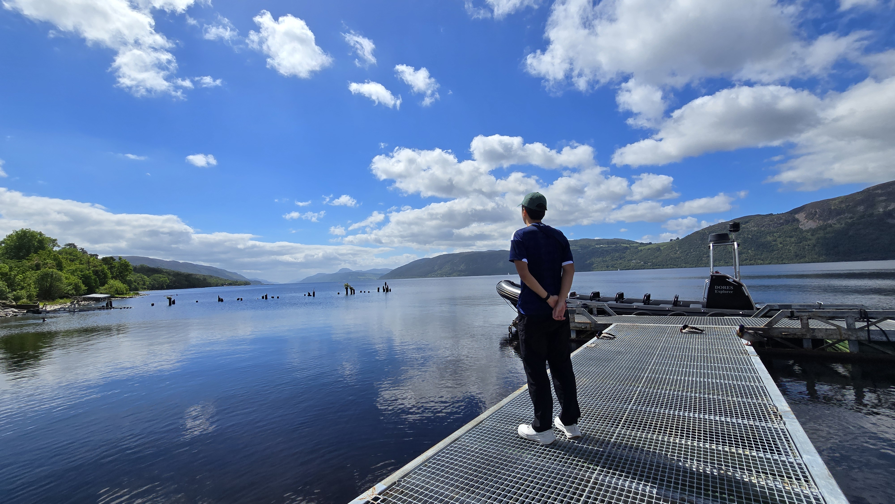

จากนั้นก็เข้าไปเดินเล่นในตัวเมือง Inverness เช่น Inverness Castle, Greig Street Bridge, Victorian Market

มื้อเย็นก็จบที่ Tesco เหมือนเดิม (คือเน้นกินบน road trip มันยาก เพราะต้องทำเวลา ก็พิจารณา trade-off กันไป)

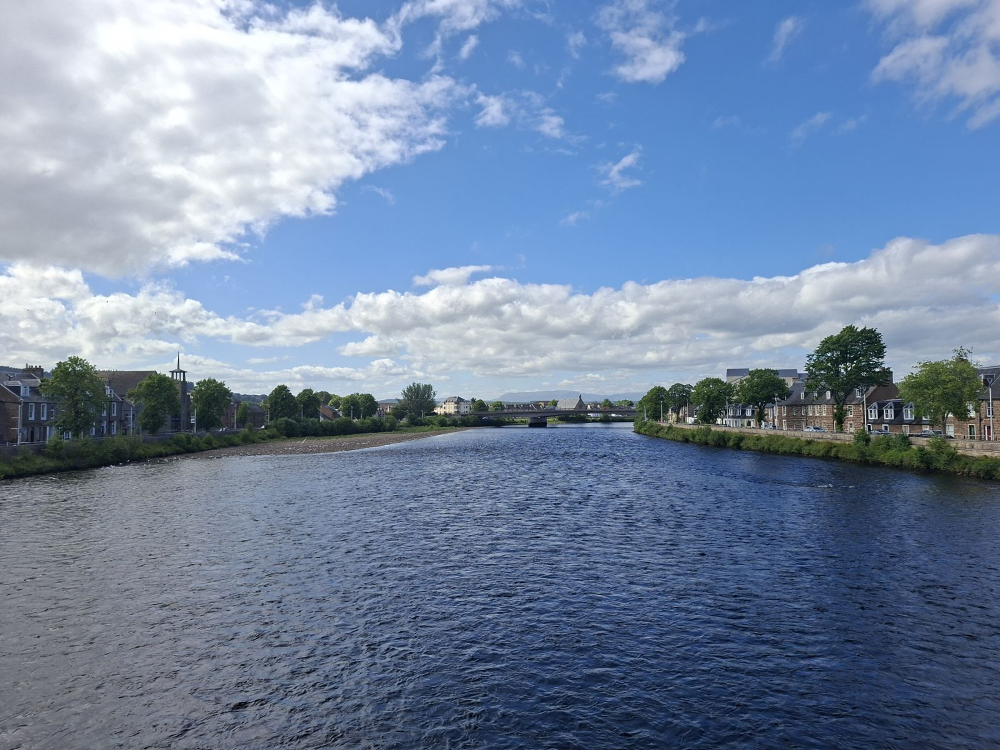

อ้อ ลืมเล่าว่าอีกสิ่งหนึ่งที่เราว้าวคือสะพานข้ามแม่น้ำที่หมุนด้วยกลไก (mechanics) ได้ เพราะต้องใช้แม่น้ำร่วมกับเรือสัญจรผ่านด้วย เป็นการรอไฟแดงที่ว้าวที่สุดละ มีอะไรให้ดู ฮ่า ๆๆๆ

---

## Day 9 — Inverness → Isle of Skye

วันที่เก้า Inverness ไป Isle of Skye

ระหว่างทางแวะกินขนมรองท้องที่ The Wee Bun House ต่อด้วยถ่ายรูป + เข้าชม Eilean Donan Castle ปราสาทเก่าแก่ที่ตั้งอยู่ริมน้ำ

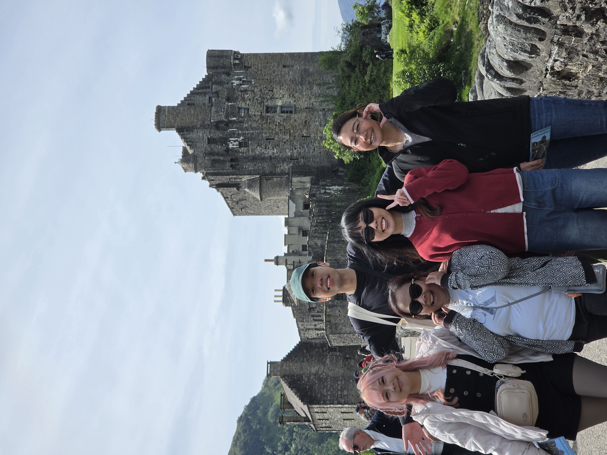

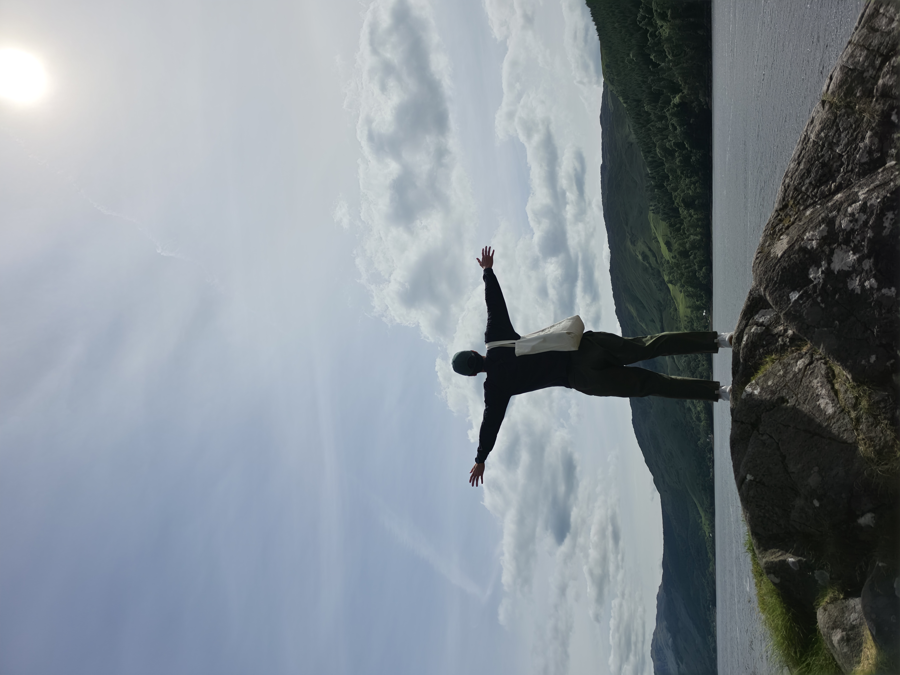

แล้วก็แวะถ่ายรูปที่ Eas a' Bhradain ซึ่งมันแปลว่าน้ำตกแห่ง Salmon

แต่ใด ๆ คือ highlight ไม่ได้อยู่ที่น้ำตก แต่อยู่ที่วิว 360 องศา ที่มองไปตรงไหนก็สวยจริง ๆ เหมือนเราคือเศษเสี้ยวเล็ก ๆ ในหุบเขาที่ใหญ่มหาศาล โอบล้อมเราพร้อมกับทุ่งหญ้าสวย ๆ ท้องฟ้าใส ๆ อากาศสดชื่น

เกินคำบรรยายจริง ๆ

ขนาดเราไม่ค่อยอินกับการเดินชมวิวนะ อันนี้คือต้องยกนิ้วโป้งให้เลย 👍

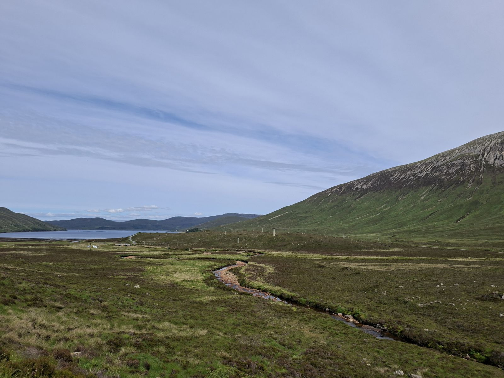

ไปกันต่อที่ Sligachan Bridge ที่มีตำนานเล่าว่า หากคุณเอาหน้าจุ่มลงในน้ำใต้สะพานเป็นเวลา 7 วินาที แล้วปล่อยให้แห้งเองตามธรรมชาติ คุณจะได้รับความงามชั่วนิรันดร์

แน่นอนว่าเพื่อน ๆ ก็ลองไปตามระเบียบ แต่คนที่ลองเป็นผู้ชายนะ ฮ่า ๆๆ

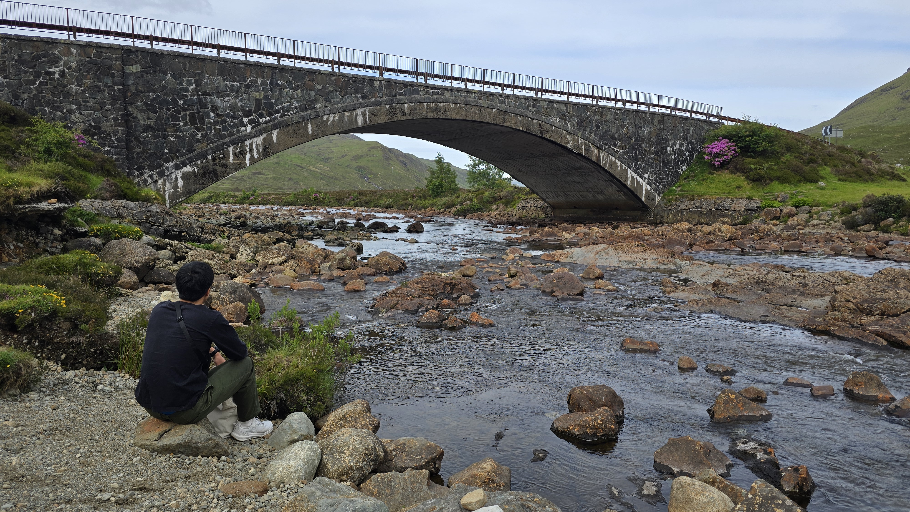

จากนั้นก็เข้าที่พัก Hostel ใน Portree ห้องน้ำรวม แน่นอนว่าวิธีเข้าที่พักก็ต้องถอดรหัสกันอีกแล้ว แต่คราวนี้เป็นปุ่มกดไฟฟ้า

ปิดท้ายมื้อเย็นที่ Dulse & Brose โคตรอิ่ม แต่รสชาติเฉย ๆ ฮ่า ๆๆ

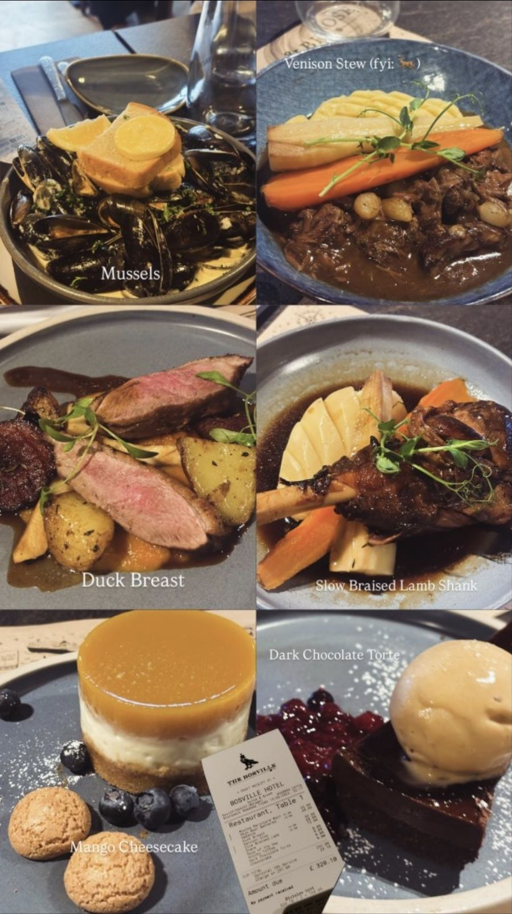

---

## Day 10 — Isle of Skye

วันที่สิบ ไปเดิน hiking ที่ The Old Man of Storr

ได้โอกาสแสดงความสามารถในการเดิน-วิ่งขึ้นแบบไว ๆ ได้ต่ำกว่า 40 นาที พอได้เหงื่อ ตั้งแต่เริ่ม road trip ยังไม่ได้ออกกำลังกายหนัก ๆ แบบวิ่งเทรลเลย กลัวเที่ยววันอื่นไม่ไหว ฮ่า ๆๆ

บรรยากาศสวยงามมาก วิวสุดลูกหูลูกตา จริง ๆ มันมีทางเดินไปไกลกว่าที่ไปวันนั้นอีกนะ ไว้โอกาสหน้าละกัน

แล้วก็รีบลงมาเพื่อปลุกใจเพื่อนร่วม trip ให้ขึ้นไปถึงยอดให้ได้ เพราะเราไม่รู้ว่า "โอกาสหน้า" นั้นจะมาอีกทีเมื่อไร ไหน ๆ ก็มาแล้ว แล้วก็มีเพื่อนร่วมทางคอยช่วยอีกเยอะ

สุดท้ายก็ไปกันถึง

**Hell Yeah!**

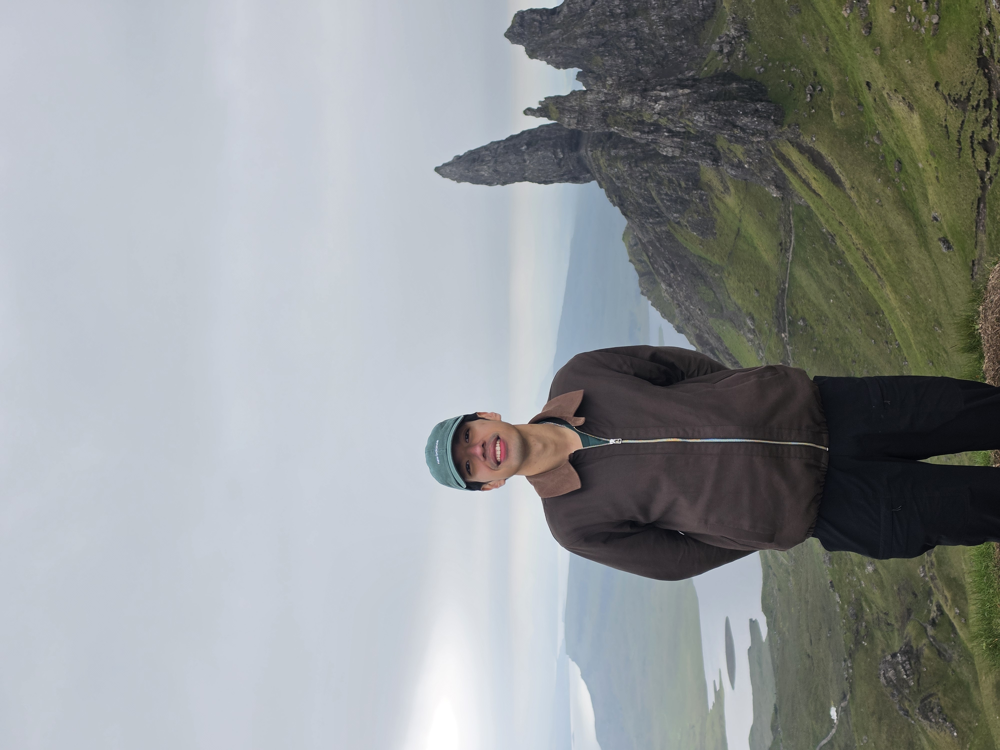

ลงเขามาก็แวะซื้อของฝากก่อนไปกินข้าวเที่ยงเติมพลังที่ The Hungry Gull

ป้ายยาเพื่อนให้ลองกิน Black Pudding ติดใจกันหลายคน ก่อนจะรู้ว่ามันทำมาจากเลือด!

ไป ๆ มา ๆ ร้านนี้อาหาร UK อร่อยสุดเลยใน trip โดยเฉพาะ Fish & Chips มันต้องอย่างนี้เลย ส่วน Soup of the Day ก็แปลกดี ซุปแตงกวา คือกันผักได้ก็เลยทนเหม็นเขียวได้ อร่อย

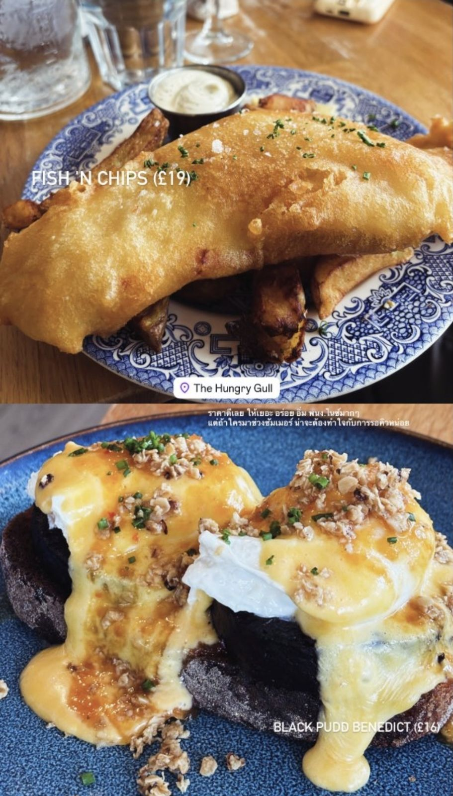

เสร็จแล้วก็ไปดูน้ำตกที่ไม่ค่อยมีน้ำที่ Mealt Falls ความพิเศษคือต้องมองจากด้านข้าง แต่พอน้ำน้อย ถ่ายรูปออกมาก็เลยไม่ค่อยสวย

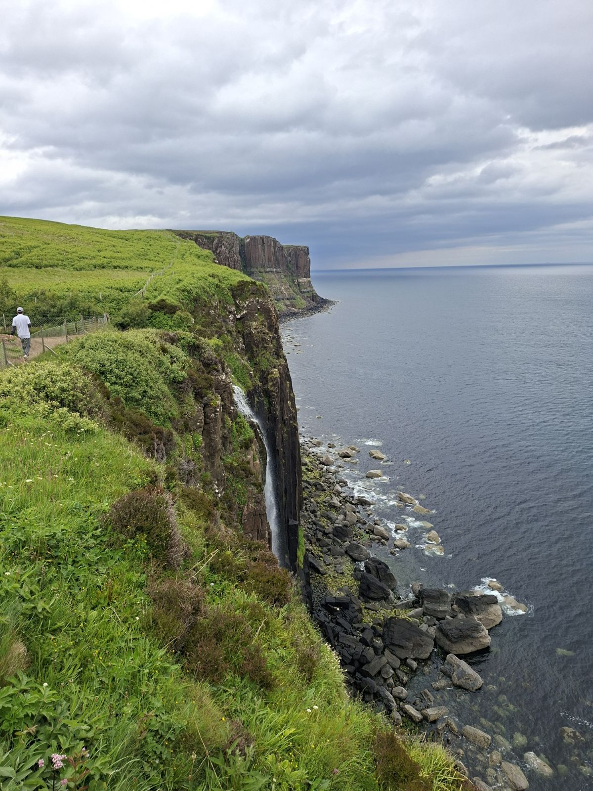

เลยออกเดินทางไป Neist Point ปรากฏว่าเจอฝนตกหนักมาก พอขับไปถึงเกือบชั่วโมงหนึ่งก็ไม่เห็นวิว แถมถ้าลงไปก็เปียกโชก ทำอะไรไม่ได้นอกจากเลี้ยวกลับ Portree

ยังดีที่มีการแสดงของวงดุริยางค์ Scottish การเป่าปี่สก็อต + เต้นแบบเพลิน ๆ ปลอบใจก่อนสั่งข้าวจากใน Portree ไปกินพรุ่งนี้เช้า

---

## Day 11 — Isle of Skye → Stirling

วันที่สิบเอ็ด กลับจาก Highlands ไปที่ Stirling

แวะกินข้าวที่ Hectors Bothy ให้เยอะ ราคาดี รสชาติพอได้

ระหว่างทางกลับก็ผ่านจุดเดิม ๆ ที่เคยแวะบ้าง ยังอยากจะแวะดูเหมือนเดิม ก็มันสวยอ่ะ ฮ่า ๆๆ

จากนั้นเราก็เข้าเมือง Glencoe แวะถ่ายรูปที่ Loch Achtriochtan เป็นทุ่งหญ้ากว้างใหญ่ตัดกับแนวเขา มีถนนแทรกตรงกลาง มีน้ำตกน้ำน้อย ๆ ประกอบข้าง ฝั่งตรงข้ามเป็นทะเลสาบ ตามรอย Skyfall

แต่ใด ๆ คืออยากอยู่ตรงนั้นอีกนาน ๆ

เรานั่งนอนชมวิวไป น้ำตารื้น เพราะมันสวยงามเหมือนกับวาดภาพเลย

ก่อนหน้านี้คือเราคิดว่าไม่ต้องไปเที่ยวก็ได้ ดูคลิปใน internet ก็เหมือนกันแหละ แต่กับที่นี่มันไม่ได้จริง ๆ

การที่เราไปยืนอยู่ในที่ที่เราเป็นส่วนเล็ก ๆ ที่มีธรรมชาติล้อมรอบ มันทำให้เราสงบได้จริง ๆ นะ

คงเป็นความรู้สึกเดียวกับเวลาเราไปวิ่งเทรลแล้วอยู่ล้อมรอบป่าเขา แค่ว่าตอนวิ่งมันเหนื่อยและร้อนไง เลยไม่มีเวลาดื่มด่ำมาก

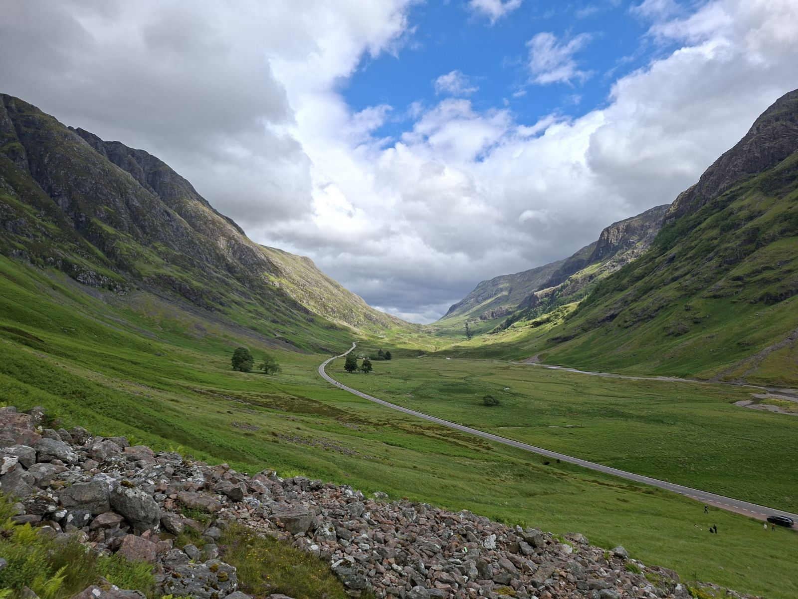

จากนั้นเราก็ถึง Stirling เข้าที่พักที่เป็นบ้าน 2 ชั้นโล่ง ๆ แล้วก็เข้าเมืองไป Stirling Castle

ก่อนแวะกินข้าวเย็นอาหารอินเดียที่ Rishis Indian Aroma

ตอนแรกเดินเข้าไปร้านไม่มีคนเลย ใจเริ่มไม่ดี แต่พอได้กินแล้วยืนยันว่าเป็นมื้อที่อร่อยที่สุดใน trip ละ และอร่อยทุกอย่างไม่มีหัก

หารกันแปดคนตกคนละ 600 บาท มีทอน

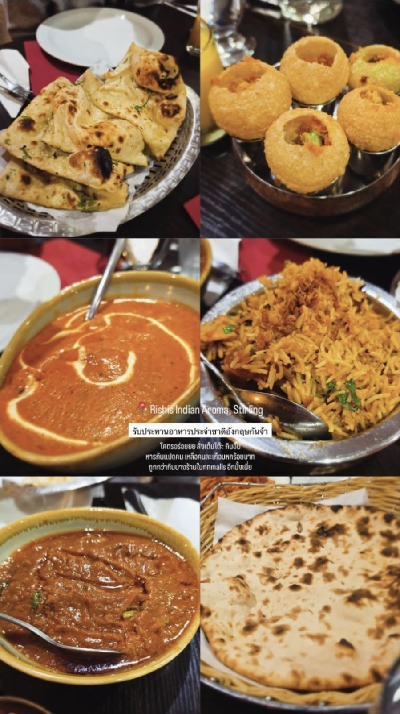

นี่สิเขาถึงว่า **"อาหารอินเดียคืออาหารประจำชาติของ UK"**

---

## Day 12 — Stirling → Falkirk → Edinburgh

วันที่สิบสอง ออกจาก Stirling ไปที่ Falkirk

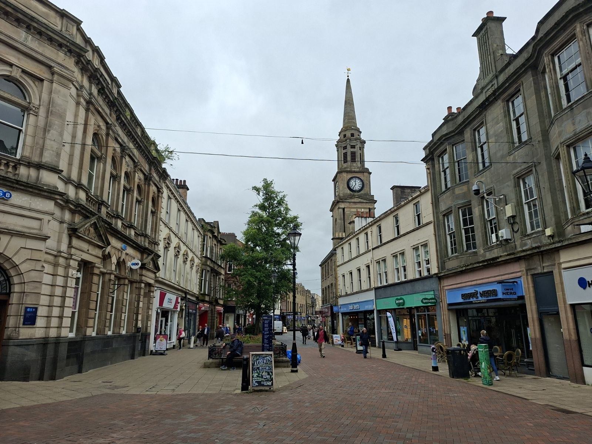

กินอาหารกรีกที่ Greek Theory Restaurant อร่อยมาก แต่ของหวานงั้น ๆ

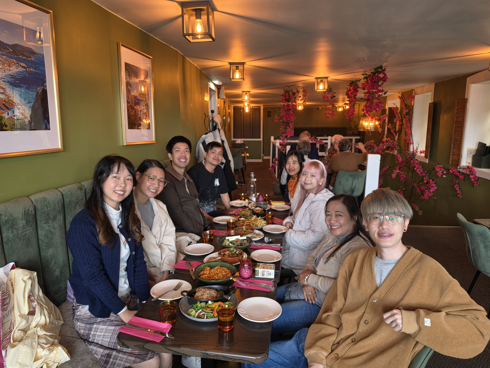

แล้วก็ไปชะโงกทัวร์ที่ Falkirk Wheel หัวม้า ซึ่งข้างในมันเข้าไปเดินได้นะ แค่คิดว่าตอนกลางคืนมีไฟน่าจะสวยมาก ๆ

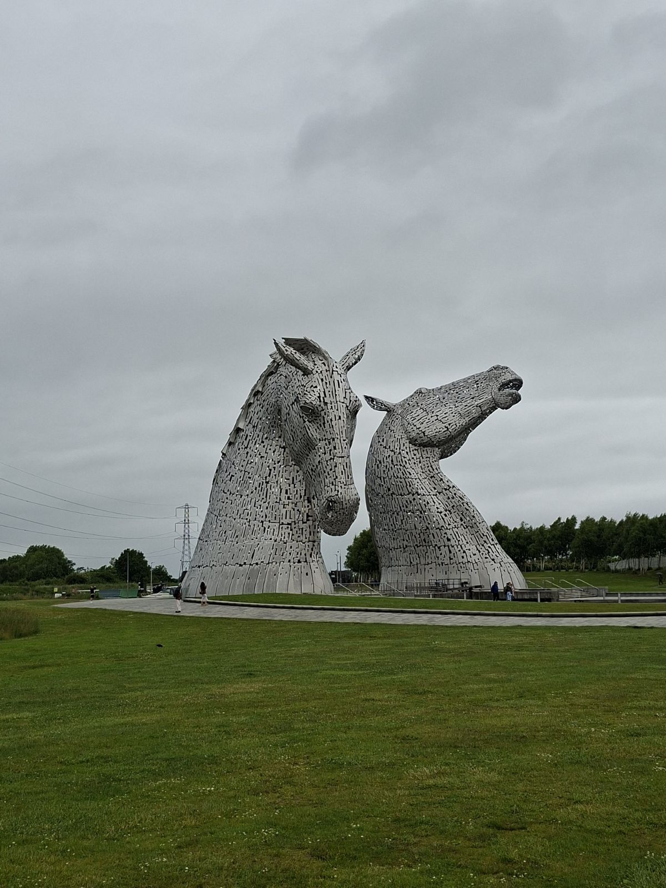

ก่อนกลับเจอ Hairy Coo วัวผมรากไทร เท่ดี

แล้วก็ไปคืนรถเช่าที่ Edinburgh เป็นอันจบวัน

---

## Day 13 — Edinburgh

วันที่สิบสาม เที่ยวในเมือง Edinburgh

เดินไปฟังเพลงปี่สก็อตไปเพลิน ๆ ชม Calton Hill อีกรอบ แล้วก็ไป National Galleries เดินชมงานศิลปะแบบเทสดี

รูปที่ชอบที่สุดคือ **A Still Life with Fruit and Lobster** เรียบง่ายแต่สวยมาก

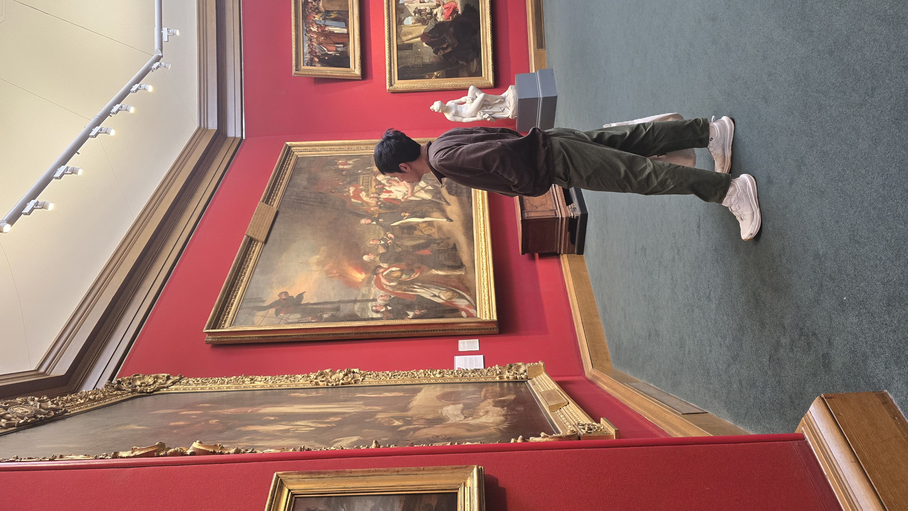

<https://artuk.org/discover/artworks/a-still-life-with-fruit-and-lobster-210181>

จากนั้นก็แวะไปหมู่บ้าน Dean Village เดินเล่นชมตึกรามบ้านช่อง มีลำธารไหลผ่าน ธรรมชาติอุดมสมบูรณ์

ปิดท้ายมื้อเย็นด้วย Chez Jules อาหารฝรั่งเศส อร่อยมาก แต่เสียงดังไปหน่อย

---

## Day 14 — Edinburgh → London → Bangkok

วันที่สิบสี่ ร่ำลาเพื่อน ๆ ที่เดินทางไปสนามบิน Edinburgh เพื่อไปจีนกันต่อ

ส่วนเราก็กลับไป London เพื่อขึ้นเครื่องบินตรงกลับไทย ผ่านรถไฟสายเดิมกับขามานั่นแหละ

รอบนี้กลับไปคือร้อนมาก มันไม่ใช่ร้อนชื้นแบบไทยนะ เป็นร้อนแห้งแบบเหมือนอยู่ในรถที่จอดตากแดดอ่ะ หายใจยังไม่สะดวกปอด

แล้วพอเข้ารถไฟฟ้าใต้ดินคือนรกจัด เพราะไม่มีแอร์ แถมคนเยอะเบียดกันอีกต่างหาก

ก่อนกลับเรามีภารกิจแยก คือการไปเยี่ยมชมสนามฟุตบอล Chelsea ทีมที่เราเชียร์มาตั้งแต่ 8 ขวบ เพียงเพราะชอบสีน้ำเงิน แค่นั้นเลย

มันมีความผูกพัน เพราะฟุตบอลก็เป็นส่วนหนึ่งของชีวิต เน้นดูบอล ส่วนเตะบอลมีบ้างแต่ไม่เป็น ฮ่า ๆๆ

ก็ได้ถ่ายรูปกับถ้วยแชมป์ต่าง ๆ ชมห้อง press conference, ห้องแต่งตัวเหย้า-เยือน, ขอบสนาม, อัฒจันทร์ตามจุดต่าง ๆ เหมือนที่ดูในทีวีเลย และก็เดิน dugout โดยมีเพลงประกอบที่ได้ยินทุกเกมเหย้ามาตลอด 20 กว่าปี

เจ้าหน้าที่ก็พาดูไป เล่าไป แต่เล่าแบบ salty หน่อยนะ เช่น ไปเทียบกับ Tottenham (ที่ฤดูกาลนั้นแม่งจบที่ 17 สภาพ) เพราะว่าฤดูกาลที่จบไปก่อนหน้านี้คือผลงานต่ำตมมาก

แต่ก็เนอะ เราไม่เปลี่ยนทีมเชียร์กัน มีขึ้นมีลงก็เชียร์กันไป แค่คิดว่าบรรยากาศมันไม่ hype เหมือนที่คิด แค่นั้นเอง

นอกนั้นคือดีหมด สมความคาดหวัง

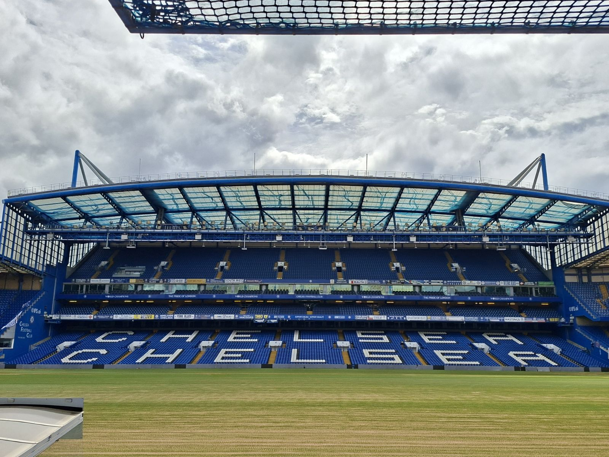

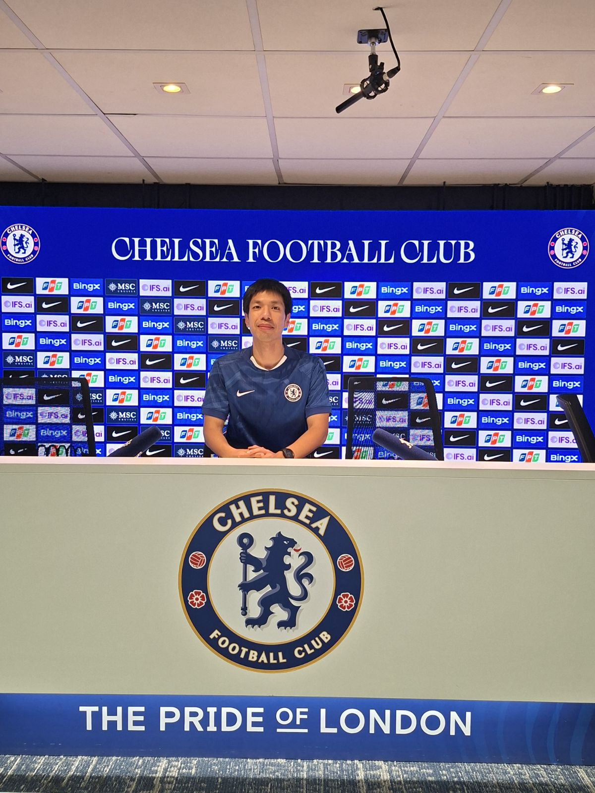

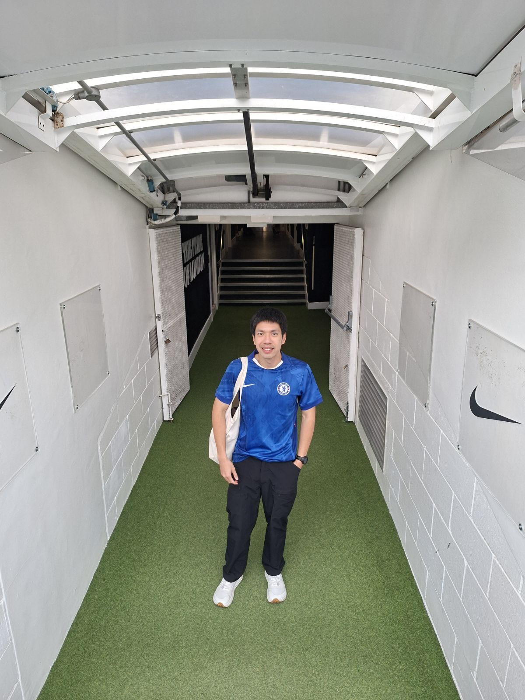

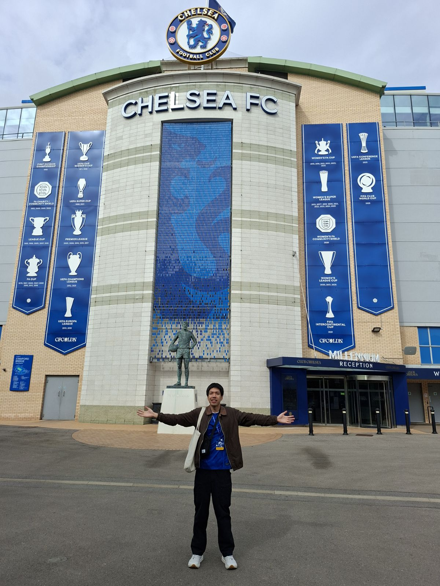

ส่วนของฝากไม่ได้ซื้อกลับ เพราะไม่สวย แถมแพงกว่าไทยอีก ฮ่า ๆๆ

ก่อนขึ้นเครื่องแวะกินข้าวที่ผับของสโมสร อร่อยนะ แต่แพงไปหน่อย

ก่อนเดินทางไปสนามบิน Heathrow ซื้อของฝากขึ้นเครื่องกลับไทย เป็นอันจบ trip โดยสมบูรณ์

---

# สิ่งที่ค้นพบระหว่าง Trip

### การขับรถใน UK

ลืมเล่าอีกแล้วว่าก่อนเราไป trip เราทำการบ้านเรื่องกฎจราจรและเทคนิคการขับรถใน UK ไปพอสมควร

พอไปขับจริงเราก็คิดว่าไม่ยาก ไม่ตื่นเต้นนะ แต่ไอ้ที่งงชิบหายเลยคือ **วงเวียน**

แล้วแต่ละวงเวียนคือต่างกัน มี 3-4-5 ทางออก ในทางออกมีทางออกแยกอีก คือแม่งงงไปหมด

แต่เราก็ blend ไปกับคนที่นั่น มีวิธีการเอาตัวรอดกันไป

จำได้ว่ามั่วครั้งเดียว คือขับเข้าไปในวงเวียนที่ไม่มีเกาะ แต่จริง ๆ แม่งมี

สรุปคือ **ปีนเกาะไปเลยจ้า** ฮ่า ๆๆ

### ห้องน้ำสาธารณะ

ทั้งอังกฤษและ Scotland มีข้อเสียอย่างหนึ่งคือไม่มีห้องน้ำสาธารณะ หรือน้อยมาก ๆ

ต้องไปเข้าในร้านอาหาร ซึ่งก็ทำได้นะแต่ต้องหน้าด้านนิดนึง หรือถ้ากังวลมากก็ซื้อของร้านเขาหน่อย

### ขนมที่ได้ลองกิน

Greggs Sausage Rolls, Ribena, Monster Munch, Tropicana น้ำส้ม, Hula Hoops, Tony's Chocolonely, Lucozade, Pret A Manger, Percy Pig, Bun From Home, Irn-Bru, Yazoo, Mr Kipling, Jaffa Cakes, Oasis, Old Jamaica Ginger Beer, Twiglets, Robinson's Raspberry & Apple, Vimto

---

## สรุป

ทริปนี้เริ่มต้นจากการถูกชวนแบบกะทันหัน มีเวลาเตรียมตัวไม่ถึง 3 เดือน และตอนแรกก็ไม่ได้คาดหวังอะไรมาก

แต่สุดท้ายกลายเป็น trip ที่ได้ทั้งเที่ยวเมือง ดูงาน tech ขับรถ road trip ลุย Highlands กินอาหารสารพัดแบบ วิ่งในเมือง เดิน hiking และได้ไปเห็นสถานที่ที่ก่อนหน้านี้คิดว่า "ดูใน internet ก็น่าจะเหมือนกันแหละ"

ปรากฏว่าไม่เหมือนจริง ๆ

โดยเฉพาะ Highlands ที่ทำให้รู้ว่าบางสถานที่มันต้องไปยืนอยู่ตรงนั้นจริง ๆ ถึงจะเข้าใจว่าทำไมคนถึงอยากไปเที่ยว

และแน่นอนว่าเป็นอีกหนึ่ง trip ที่ทำให้ได้รู้ว่า...

**ประเทศที่ขับรถวงเวียนได้หลายแบบนี่แม่งไม่ธรรมดาเลย ฮ่า ๆๆ**
